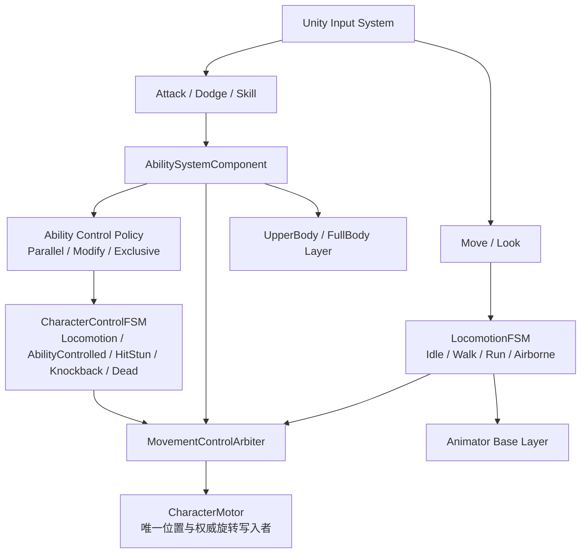

# RPG-DEMO 状态机与 GAS 重构实施规划

## 1. 结论

本次重构应保留《Unity GAS 风格〈绝区零〉战斗 Demo 实现设计》中的“两层状态机 + GAS + 单一 Motor”结构，而不是把所有非移动状态都删除。

准确边界如下：

- `CharacterControlFSM` 管理角色当前的控制权模式：`Locomotion / AbilityControlled / HitStun / Knockback / Dead`。
- `LocomotionFSM` 只管理普通移动：`Idle / Walk / Run / Airborne`。
- GAS 管理具体技能身份和技能内部流程：普攻段数、连招窗口、派生、闪避、极限闪避、蓄力、冷却、消耗、打断关系。
- 状态机中不能出现 `Attack01 / Attack02 / Dodge / Combo / ChargeSkill` 等具体技能状态。
- Ability 通过 `Parallel / ModifyLocomotion / Exclusive` 决定是否继续普通移动、修正普通移动，或进入统一的 `AbilityControlled`。
- `HitStun / Knockback / Dead` 是高优先级控制状态，不是技能状态。它们可以抢占 `Locomotion` 和 `AbilityControlled`。
- 所有普通移动、技能位移、Root Motion、击退最终都只能由 `CharacterMotor` 写入角色位置。

原设计的核心方向是正确的。需要调整的是：不能把 `CharacterControlFSM` 删除成纯策略聚合器，而应让 `MovementControlArbiter` 作为两层 FSM 与 Motor 之间的控制权仲裁层。

## 2. 已验证的当前工程事实

### 2.1 RPG-DEMO 仍是框架骨架

- 当前 `ControllerStates` 只有 `Inactive / Playing / Spectating`，它表达 Controller 生命周期，不是角色移动或战斗状态，见 `Assets/GameFramework/Runtime/Controller/ControllerStates.cs:3`。
- `CharacterMovementComponent` 的 `MovementMode` 只有 `None / Walking`，见 `Assets/GameFramework/Runtime/Movement/CharacterMovementComponent.cs:5`。它是物理分派枚举，还不是带 `Enter / Update / Exit` 的 Locomotion FSM。
- 当前唯一实际位移写入点是 `CharacterController.Move`，见 `Assets/GameFramework/Runtime/Movement/CharacterMovementComponent.cs:140` 和 `:151`。这个入口可以继续演进为单一 Motor。
- `Pawn.SetupPlayerInputComponent` 仍为空，见 `Assets/GameFramework/Runtime/Pawn/Pawn.cs:103`；输入资产虽然有 `Move / Look / Attack / Sprint / Jump`，但还没有接到角色逻辑。
- `Pawn.FaceRotation` 为空，见 `Assets/GameFramework/Runtime/Pawn/Pawn.cs:204`，所以技能期间的转向控制目前没有执行落点。
- 当前没有 Ability、GameplayTag、GameplayEffect、闪避、连招、Animator、AvatarMask、Root Motion 适配或运行时网络实现。
- `Multiplayer Center` 不是网络运行时方案。当前 `HasAuthority`、`IsLocalController` 只是占位，不能作为预测或服务器权威实现。
- SampleScene 尚未挂载当前 GameFramework 脚本，因此实施前必须先建立最小可玩测试场景。

### 2.2 当前代码中需要避免的误用

- `Controller.StateName` 只能继续表示 `Playing / Inactive / Spectating`。Ability 不应调用它来表示攻击、硬直或死亡。
- `SetIgnoreMoveInput` 和 `SetIgnoreLookInput` 只能全开/全关，无法表达“移动减速、允许有限转向、面向目标、上半身施法”等策略，也不能安全解决多个限制来源的重叠释放。
- `CharacterMovementComponent.SetMovementMode` 是最后写入者覆盖。两个 Ability 或 Effect 同时限制移动时，一个先结束就可能错误解除另一个限制。
- 当前 `MovementMode.None` 直接停止物理更新但不会清理旧速度；恢复 `Walking` 后可能出现旧速度回弹。新控制权系统不能简单依赖 `None` 实现技能锁移动。

## 3. 文档中的目标架构

专项设计文档位于：`E:/gameplay-ability-system-for-unity/Unity_GAS_绝区零Demo实现设计.md`。

可直接确认的设计依据：

- 不把移动、攻击、闪避、连招等平铺到一个巨大状态机：文档 `2.1`，约第 25 行。
- `CharacterControlFSM`、`LocomotionFSM`、GAS、Motor、Animator 分层：文档 `2.2`，约第 59 行。
- 所有位移由单一 `CharacterMotor` 执行：文档 `2.3`，约第 92 行。
- 上层控制模式为 `Locomotion / AbilityControlled / HitStun / Knockback / Dead`：文档 `3.1`，约第 129 行。
- Ability 使用 `Parallel / ModifyLocomotion / Exclusive` 三种移动控制策略：文档 `3.3`，约第 226 行。
- 上半身技能与 Locomotion 并行，使用 Animator UpperBody Layer 和 Avatar Mask：文档 `10.1~10.2`，约第 855 行。
- Ability 具有独立转向策略：`FollowMovement / FaceAim / FaceTarget / Locked`：文档 `10.3`，约第 921 行。
- 移动事实通过 `Movement.Mode.Grounded / Airborne` Tag 提供给 GAS，Ability 决定规则，Movement 执行物理：文档 `13.2~13.4`，约第 1149 行。

### 3.1 正确的运行关系



### 3.2 控制状态的优先级

建议优先级：

| 控制模式 | 建议优先级 | 说明 |
|---|---:|---|
| `Dead` | 100 | 取消全部可取消 Ability，禁用普通移动和转向 |
| `Knockback` | 90 | 外力或强制位移接管 Motor，可按规则取消 Ability |
| `HitStun` | 80 | 阻止普通操作，可取消或阻止指定 Ability |
| `AbilityControlled` | 40~70 | 由当前 Exclusive Ability 的策略决定 |
| `Locomotion` | 0 | 普通移动默认控制模式 |

这里的优先级属于控制权仲裁，不是技能伤害、连招段数或动画优先级。

## 4. Ability 如何决定是否改变状态机

每个 Ability 应声明以下正交策略，而不是直接硬编码状态跳转：

```csharp
public enum AbilityControlPolicy
{
    Parallel,
    ModifyLocomotion,
    Exclusive
}

public enum AbilityAnimationPolicy
{
    None,
    UpperBody,
    FullBody
}

public enum AbilityRotationPolicy
{
    FollowMovement,
    FaceAim,
    FaceTarget,
    Locked
}
```

策略语义：

| Ability 类型 | ControlPolicy | CharacterControlFSM | LocomotionFSM | 动画 | 转向 |
|---|---|---|---|---|---|
| 被动 Buff | `Parallel` | 保持 `Locomotion` | 正常更新 | 可无 | 不接管 |
| 可移动上半身施法 | `Parallel` | 保持 `Locomotion` | 正常更新 | `UpperBody` | 可 `FaceAim` 或限速转向 |
| 蓄力减速 | `ModifyLocomotion` | 保持 `Locomotion` | 继续更新，但速度乘倍率 | 上半身或全身 | 可配置最大 Yaw 速度 |
| 普通全身攻击 | `Exclusive` | 进入 `AbilityControlled` | 暂停普通移动输出 | `FullBody` | 锁定或按曲线允许转向 |
| 闪避/突进 | `Exclusive` | 进入 `AbilityControlled` | 暂停普通移动输出 | `FullBody` | Ability 提交位移源与朝向策略 |
| 受击硬直 | 非 Ability 策略 | 进入 `HitStun` | 暂停 | `FullBody` | 通常锁定 |
| 击退 | 非 Ability 策略 | 进入 `Knockback` | 暂停 | `FullBody` | Motor 处理外力 |
| 死亡 | 非 Ability 策略 | 进入 `Dead` | 停止 | `FullBody` | 禁止 |

### 4.1 允许 Ability 切状态，但不能直接引用具体状态类

推荐调用关系：

```text
Ability 激活
  -> 根据 AbilityControlPolicy 创建 MovementControlHandle
  -> Exclusive 请求 CharacterControlFSM.EnterAbilityControlled(ActivationId, MotionSource)
  -> Parallel / ModifyLocomotion 不退出 Locomotion
  -> Ability End / Cancel 统一释放 Handle
  -> 若当前没有更高优先级控制状态，重新根据 Grounded 和当前输入选择 Idle / Walk / Run / Airborne
```

Ability 不应执行：

```text
ChangeState("Attack03")
ChangeState("Dodge")
transform.position += dodgeDelta
animator.SetBool("IsAttack03", true)
```

Ability 可以执行：

```text
RequestControl(Exclusive, activationId)
SubmitAbilityMotion(motionSource)
PlayFullBody(actionId, activationId)
RequestRotation(FaceTarget, maxYawSpeed)
```

### 4.2 句柄式资源管理

移动、旋转、动画、无敌窗口、HitBox 和事件订阅都必须返回带拥有者的句柄，并由 Ability 的统一清理路径释放。

这样可以解决：

- 攻击与受击同时限制移动时，攻击先结束不会错误解除受击限制。
- 旧 Ability 的动画结束事件不会结束新 Ability。
- Ability 被死亡、硬直、换 Pawn、Disable 或异常取消时，不会遗留移动锁、上半身 Layer 权重或无敌 Tag。

## 5. GAS for Unity 的复用结论

源工程：`E:/gameplay-ability-system-for-unity`，版本清单为 `com.exhard.exgas 1.1.8`，许可证为 MIT。两个工程都是 Unity `2022.3.62f3c1`，Unity 版本本身兼容。

结论是“抽取并修正运行时核心”，不建议把整个 `Assets/GAS` 原样复制进 RPG-DEMO。

验证结果：`com.exhard.exgas.runtime.csproj --no-restore` 当前编译为 `0 error`，但有 4 个程序集版本冲突警告；Assets 下未发现项目自身的 Runtime/EditMode/PlayMode 测试，也未验证 Player Build。因此这里只能确认“现有 Unity 生成工程能编译”，不能确认运行时正确性、发布兼容性或网络可用性。

### 5.1 可作为底座复用

| 模块 | 结论 | 依据与用途 |
|---|---|---|
| `AbilityAsset / AbstractAbility / AbilitySpec` 三层结构 | 修正后复用 | 已有配置、定义、运行实例分层；`AbilitySpec.CanActivate` 已检查激活 Tag、Cost、Cooldown，见 `AbilitySpec.cs:89` |
| Ability 激活/结束/取消生命周期 | 修正后复用 | `TryActivateAbility / TryEndAbility / TryCancelAbility` 已有基本闭环，见 `AbilitySpec.cs:171` |
| `AbilitySystemComponent` 组合根 | 修正后复用 | 已组合 Ability、GE、Attribute、Tag 容器，见 `AbilitySystemComponent.cs:16` 和 `:26` |
| `Attribute / AttributeSet / Aggregator` 数据模型 | 修正后复用 | 可承载 Health、Energy、Poise 等属性，但要补测试和稳定刷新语义 |
| `GameplayEffect` 的 Instant / Duration / Infinite、Modifier、MMC | 修正后复用 | 可用于伤害、能量消耗、冷却、Buff/Debuff |
| Ability Tag 的 Required / Blocked / Cancel / Block 思路 | 修正后复用 | `AbilityAsset.cs:87` 起已有这些字段，可用于技能互斥基础 |
| GameplayCue 概念 | 后期复用 | 适合特效/音效表现，不适合作为权威动画或技能流程 |

### 5.2 必须适配或重写

| 模块 | 处理方式 | 原因 |
|---|---|---|
| `GameplayTag` ID 与层级判断 | 重写 | 当前使用 `string.GetHashCode()`，不适合跨进程、跨平台或网络稳定 ID，见 `GameplayTag.cs:16-35`；`IsDescendantOf` 的实现方向也有问题，见 `:63-66` |
| Ability 执行实例/Handle | 重写 | 当前以字符串 UniqueName 查找，缺少稳定 `SpecHandle / ActivationId / PredictionKey`，不能隔离多次激活和旧事件 |
| Ability 取消遍历 | 修正 | 当前激活后直接遍历 Ability 字典并取消，见 `AbilityContainer.cs:68-78`；取消回调若修改容器可能破坏遍历 |
| 生命周期计数 | 修正 | `ActiveCount` 只在激活时增加，见 `AbilitySpec.cs:49` 和 `:179`，结束/取消不减少 |
| Cost/Cooldown Commit | 重构 | 当前检查与真正扣费分离且不是原子操作，`DoCost` 还把 Cost 和 Cooldown 合并提交，见 `AbilitySpec.cs:119-169` |
| Ability 关系表 | 新写 | 当前只有每个 Ability 自带数组，没有文档要求的集中 `GameplayTagRelationshipMap` |
| 输入与预输入缓冲 | 新写 | EX-GAS 不负责 Unity Input 到 InputTag 的路由，也没有 ARPG 带时间戳、有效期和消费规则的缓冲 |
| MovementControlArbiter 与两层 FSM 适配 | 新写 | EX-GAS 没有 `Parallel / ModifyLocomotion / Exclusive`、移动句柄、位移源或 CharacterMotor 接口 |
| 动画驱动 | 新写 | 当前 `CueAnimation` 只调用 `Animator.Play`，移除时为空，见 `CueAnimation.cs:81-91`；不支持 Base/UpperBody/FullBody 通道、AvatarMask、抢占和 ActivationId |
| TimelineAbility | 暂不接入 | README 明确标记 WIP；它依赖渲染帧/墙钟并存在跨激活缓存风险，不适合第一版可预测战斗时间轴 |
| Tick/时钟 | 重写适配 | EX-GAS 由隐藏 `GasHost.Update` 全局 Tick，见 `GasHost.cs:10-14`；`GASTimer` 使用 UTC 墙钟，见 `GASTimer.cs:8-26`。这与固定 Tick、暂停、回滚和服务器重演不兼容 |
| 网络同步与预测 | 新写 | EX-GAS 没有 RPC、GE 复制、Ability 预测或回滚；README 也明确列为未支持功能 |
| Odin 依赖 | 去除或隔离 | README 明确依赖 Odin 3.2+；Runtime 中也存在大量 `Sirenix.OdinInspector` 引用。既然暂时忽略可视化，应移除 Odin 特性或放入可选 Editor Assembly |
| 自动化测试 | 新写 | GAS Runtime 目录没有测试程序集，原 README 也提示稳定性与测试不足 |

### 5.3 推荐的复用方式

不要在 RPG-DEMO 中直接引用另一个工程目录，也不要把付费 Odin 插件一起迁移。推荐流程：

1. 在 RPG-DEMO 中新建独立 Runtime Assembly。
2. 只迁移 MIT 许可的 GAS Runtime 核心，并保留许可证声明。
3. 移除所有 Odin 展示特性和 Runtime 对 `UnityEditor` 的引用。
4. 先为迁移代码补 Characterization Tests，固定现有行为。
5. 再逐项修复 Tag、生命周期、容器重入、时钟和 Handle。
6. 最后通过 `RPGAbilitySystemAdapter` 接入 CharacterControlFSM、MovementControlArbiter、AnimationDriver 和 InputRouter。

## 6. 推荐代码边界

```text
Assets/GameFramework/Runtime
├─ Controller
│  ├─ Controller.cs
│  ├─ ControllerStates.cs              # 仍表示 Controller 生命周期
│  └─ PlayerController.cs
├─ Input
│  ├─ InputComponent.cs
│  ├─ CombatInputRouter.cs
│  ├─ CombatInputBuffer.cs
│  ├─ BufferedInput.cs
│  └─ InputTag.cs
├─ Pawn
│  ├─ Pawn.cs
│  └─ Character.cs
├─ Movement
│  ├─ CharacterMovementComponent.cs
│  ├─ CharacterMotor.cs
│  ├─ MotorState.cs
│  ├─ MoveCommand.cs
│  ├─ CharacterControlStateMachine.cs
│  ├─ CharacterControlMode.cs
│  ├─ LocomotionStateMachine.cs
│  ├─ LocomotionState.cs
│  ├─ MovementControlArbiter.cs
│  ├─ MovementControlHandle.cs
│  ├─ MovementPolicy.cs
│  ├─ AbilityMotionSource.cs
│  └─ ExternalForceSource.cs
├─ Animation
│  ├─ CombatAnimationDriver.cs
│  ├─ AnimationRequest.cs
│  ├─ AnimationHandle.cs
│  ├─ AnimationEventRouter.cs
│  └─ AbilityAnimatorBridge.cs
└─ AbilitySystem
   ├─ Core
   │  ├─ AbilitySystemComponent.cs
   │  ├─ GameplayAbility.cs
   │  ├─ AbilitySpec.cs
   │  ├─ AbilitySpecHandle.cs
   │  ├─ AbilityActivationHandle.cs
   │  └─ AbilityContext.cs
   ├─ Tags
   ├─ Attributes
   ├─ Effects
   ├─ Relationships
   └─ Integration
      ├─ AbilityMovementBridge.cs
      ├─ AbilityAnimationBridge.cs
      └─ MovementTagBridge.cs
```

不建议让 `CharacterMovementComponent` 直接引用具体的 `NormalAttackAbility` 或 `DodgeAbility`；桥接层只依赖策略、句柄、Tag 和 MotionSource 接口。

## 7. 具体实施阶段

### 阶段 0：固定架构契约与测试基线

任务：

1. 保留当前脏工作树，不覆盖现有 ProjectSettings、Packages 和 Movement `.meta` 变更。
2. 建立 Runtime/EditMode/PlayMode asmdef 与测试目录。
3. 建立最小测试场景并挂载 PlayerController、Character、CharacterController、CharacterMovementComponent 和 InputAction。
4. 接通 `Move / Look / Sprint / Jump` 最小输入链。
5. 记录当前 Walking 加速、摩擦、停止行为作为回归基线。

验收：角色可以离线移动、停止和转向；输入到 Motor 的调用顺序可观测；测试场景不依赖技能。

### 阶段 1：完成单一 CharacterMotor 和移动状态

任务：

1. 将输入采样与移动仿真拆开，使用固定 Tick `MoveCommand`。
2. 建立可捕获/恢复的 `MotorState`，至少包含位置、旋转、速度、物理 MovementMode、Grounded 信息。
3. 让 `CharacterMotor.Simulate(command, state, dt)` 成为唯一 `CharacterController.Move` 调用者。
4. 实现 `LocomotionFSM`：首批 `Idle / Walk / Run / Airborne`。
5. 区分“物理 MovementMode”和“表现/输入驱动 LocomotionState”，避免用世界总速度把闪避误判为 Run。

验收：相同初始状态、命令和 Tick 数得到相同结果；源码中只有 Motor 写权威 Transform。

### 阶段 2：实现上层 CharacterControlFSM

任务：

1. 实现 `Locomotion / AbilityControlled / HitStun / Knockback / Dead`。
2. 实现明确的 Enter/Exit 和优先级抢占规则。
3. `AbilityControlled` 只保存 ActivationHandle 和 MotionSource，不知道 Attack/Dodge/Skill 类型。
4. Exclusive Ability 结束后，不恢复旧 RunState；必须重新根据 Grounded、当前输入和 RunHeld 选择 LocomotionState。
5. HitStun、Knockback、Dead 进入时按 TagRelationshipMap 取消或阻止 Ability。

验收：Run 中进入 AbilityControlled 会调用 Run.Exit；技能期间松开方向，结束后进入 Idle；跌落平台后结束则进入 Airborne；Dead 不会被任何 Ability End 错误解除。

### 阶段 3：实现 MovementControlArbiter

任务：

1. 实现 `Parallel / ModifyLocomotion / Exclusive`。
2. 将移动输入、最大速度倍率、位移源、外力和旋转策略拆成独立通道。
3. 所有请求返回带 owner、priority、activationId 的 Handle。
4. 支持多个请求重叠，并在 End/Cancel/Disable/UnPossess 时幂等释放。
5. 定义帧顺序：输入采样 -> GAS 决策 -> 控制权聚合 -> Motor 固定 Tick -> Animation 表现。

验收：两个来源同时锁移动时，先释放一个不会恢复移动；高优先级 HitStun/Dead 始终覆盖 Ability；稳定 Tick 无句柄泄漏。

### 阶段 4：迁移并加固 GAS Runtime 核心

任务：

1. 迁移 Ability、ASC、Tag、Attribute、GE 的最小子集，去除 Odin/Editor 依赖。
2. 重写 GameplayTag 为稳定 ID，并修复父子匹配、default/null 语义。
3. 引入 `AbilitySpecHandle / AbilityActivationId`，避免以字符串和复用实例作为唯一身份。
4. 统一 `Activate -> Commit -> End/Cancel -> Cleanup` 生命周期。
5. 修复取消时容器重入、ActiveCount、Cost/Cooldown 原子性、Disable/Re-enable 清理等问题。
6. 新增集中式 `GameplayTagRelationshipMap`。
7. 将 GAS Tick 接入项目固定仿真时钟，不使用隐藏 GameObject 的墙钟 Update。

验收：Ability 激活失败能返回结构化原因；结束与取消都只清理自己的 Tag/Handle；重入取消不抛异常；Cost 和 Cooldown 不会重复提交。

### 阶段 5：输入路由与预输入缓冲

任务：

1. `Move / Look` 继续直接进入 Controller/Locomotion 输入链。
2. `Attack / Dodge / Skill / Ultimate` 转换成 `InputTag + Pressed/Held/Released` 送入 GAS。
3. 实现带 Timestamp、ExpireTime、Sequence 和 consumed 状态的 `CombatInputBuffer`。
4. Ability 关系由 Tag 决定，连招窗口由 Ability 内部动作数据决定；二者不能混在一个关系表中。

验收：提前短时间按攻击可以接段；过早输入会过期；一次输入不会同时被派生和普通下一段消费；UI 输入层不会粗粒度阻断 Move。

### 阶段 6：动画三通道与转向控制

任务：

1. 建立 Base、UpperBody、FullBody 三个动画通道。
2. UpperBody Layer 使用 Avatar Mask，排除 Root/Pelvis/Leg/Foot；技能动画优先使用 In-place。
3. AnimationRequest 携带 `AbilityActivationId / ActionInstanceId`。
4. Ability 通过 Handle 播放和停止动画，旧事件必须校验实例 ID。
5. 实现 `FollowMovement / FaceAim / FaceTarget / Locked`，并增加 `MaxYawSpeed` 或允许角度等限制参数。
6. Root Motion 只由 RootMotionAdapter 转为 MotionSource，再交给 Motor 做碰撞和位移。

验收：跑步释放 UpperBody 技能时下半身继续跑；松开方向后进入 Idle 但技能继续；允许转向的技能按速率转向，Locked 技能不转；取消技能后 Layer 权重、事件和句柄全部清理。

### 阶段 7：三个纵向切片验证架构

按以下顺序实现，不要一开始就做完整四段连招：

1. `UpperBodyCastAbility`：Parallel + UpperBody + 有限 FaceAim。验证真正并行。
2. `SimpleFullBodyAttackAbility`：Exclusive + FullBody + 无位移。验证 AbilityControlled 与恢复 Locomotion。
3. `DodgeAbility`：Exclusive + FullBody + AbilityMotionSource + 无敌窗口。验证单一 Motor、取消和碰撞。
4. 增加 HitStun/Knockback/Dead，验证高优先级抢占与清理。

只有这四个场景稳定后，再进入完整连招。

### 阶段 8：连招、派生、极限闪避和蓄力

任务：

1. 一个 `NormalAttackComboAbility` 管理四段连招，段数保存在 Ability 实例内部，不进入 FSM 或 Tag。
2. 使用 ActionData/Timeline 数据定义 HitWindow、ComboWindow、BranchWindow、DodgeCancelWindow。
3. 第三段派生输入优先于普通第四段，并保证一次输入只消费一次。
4. 普通无敌窗口与 PerfectDodge 窗口使用独立句柄。
5. 蓄力使用 Pressed/Held/Released，并按能量与时间选择分支。

验收：覆盖专项设计文档第 18 章列出的移动、连招、闪避和蓄力场景。

### 阶段 9：同步与预测

“同步”需要分成两件事：

- 同一角色上移动与 Ability 是否可并行：由 ControlPolicy、AnimationPolicy 和 RotationPolicy 解决。
- 联机状态是否复制/预测：EX-GAS 当前没有实现，必须单独建设。

在没有选定 NGO、Mirror、FishNet 或自研网络层前，先只定义传输无关契约：

1. `NetworkExecutionPolicy`：`LocalOnly / ServerInitiated / LocalPredicted / ServerOnly`。
2. Ability 激活命令：SpecHandle、InputSequence、ClientTick、目标数据、预测 Key。
3. 权威 Ability 状态：ActivationId、开始 Tick、阶段、必要 Tag/Effect 和结束原因。
4. 移动预测数据：MoveCommand + 可序列化 MovementModifier/MotionSource。
5. MotorState：位置、旋转、速度、MovementMode、控制模式及影响下一 Tick 的 MotionSource 状态。
6. Owner 使用预测与回滚；远端 Observer 只插值权威快照和播放表现。
7. 扣资源、伤害、音效、特效必须用 PredictionKey/EventId 去重，回滚重放不能重复副作用。

验收：同一初始 MotorState、MoveCommand 和 Ability Motion 数据在首次执行、服务端执行和客户端 replay 中一致；100ms 延迟和丢包下 owner 最终收敛；observer 不运行 owner 回滚。

## 8. 必须优先编写的测试

### 状态与控制权

- Parallel Ability 激活时仍为 `Locomotion`，LocomotionFSM 正常迁移。
- ModifyLocomotion 只改变速度/转向策略，不进入 `AbilityControlled`。
- Exclusive Ability 进入统一 `AbilityControlled`，状态中不包含技能名。
- HitStun/Knockback/Dead 可以按优先级抢占 AbilityControlled。
- Ability 结束顺序不同，不会提前释放其他来源的限制。

### 动画与转向

- UpperBody 技能不覆盖腿部移动动画。
- FullBody 技能能抢占动作通道，但不直接写 Transform。
- 旧 ActionInstanceId 的事件不会操作新技能。
- `FaceTarget` 受 MaxYawSpeed 限制，`Locked` 不发生权威旋转。

### GAS

- Required/Blocked/Cancel/Block Tag 组合。
- Cost 不足、Cooldown、重复激活的失败原因。
- End/Cancel/Disable/Death/UnPossess 每条路径清理完全且幂等。
- GameplayTag 稳定 ID 在进程重启和序列化后保持一致。

### Motor 与未来网络

- 同命令重复执行结果一致。
- Capture/Restore/Replay 后位置、速度、旋转、MovementMode 和控制状态一致。
- Root Motion、闪避位移和击退都经过碰撞，不发生双写。
- 回滚不重复伤害、扣费、音效或 VFX。

## 9. 风险与实施约束

1. RPG-DEMO 与 GAS 工程的工作树都不是干净状态。实现时不得 reset、checkout 或覆盖用户现有修改。
2. EX-GAS README 明确提示依赖 Odin、测试不足且不稳定。不能因为 Unity 版本一致就判断为可整包生产使用。
3. 当前没有真实网络库。网络阶段的接口可以先做，不能伪装成已经支持同步。
4. TimelineAbility 暂不作为第一版技能时间轴；先用代码驱动 ActionTimeline/Window 数据建立可测试语义。
5. Controller 生命周期状态、CharacterControlFSM、LocomotionFSM 和物理 MovementMode 是四个不同概念，命名和调试面板必须分开显示。
6. AbilityControlled 是通用控制模式，不是“技能状态集合”；同一时刻具体是哪一个技能必须由 ActivationHandle/ASC 查询。

## 10. 推荐的第一个实施里程碑

第一个里程碑只做到以下闭环：

```text
可操作测试角色
  + 固定 Tick CharacterMotor
  + LocomotionFSM(Idle/Walk/Run/Airborne)
  + CharacterControlFSM(Locomotion/AbilityControlled/HitStun/Knockback/Dead)
  + MovementControlArbiter
  + 加固后的最小 ASC/Ability/Tag
  + UpperBodyCastAbility
  + SimpleFullBodyAttackAbility
  + DodgeAbility
  + Base/UpperBody/FullBody AnimationDriver
```

完成标准不是“功能数量多”，而是以下三条同时成立：

1. 上半身技能可以边移动边释放，并按配置有限转向。
2. 全身技能和闪避可以进入统一 AbilityControlled，但状态机里没有任何技能名。
3. HitStun/Knockback/Dead 能可靠抢占并清理 Ability，所有位移仍只有 Motor 一个写入者。

这个里程碑通过后，再做四段连招、第三段派生、极限闪避、蓄力和网络预测，可以显著减少返工。
