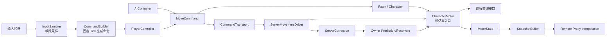

# RPG-DEMO：UE 风格 Gameplay Framework 深度复刻执行路线

> 项目目录：`E:\RPG-DEMO`  
> UE 源码目录：`C:\Program Files\Epic Games\UE_5.7\Engine\Source`  
> 文档用途：交给 AI Agent 按阶段实现、测试和汇报。  
> 最终目标：在 Unity 中实现一条 UE 风格的角色控制主链，并将其推进为“服务器权威、拥有者本地预测、纠错回滚重放、远端插值”的多人角色移动框架。

---

## 1. 项目定位

这个项目不应停留在“把 UE 的类名翻译成 C#”。真正有技术深度的复刻目标是：

```text
Gameplay Framework 生命周期
    ↓
输入意图与固定 Tick 命令
    ↓
可保存、可恢复、可重放的 Character Motor
    ↓
服务端使用相同命令执行权威移动
    ↓
拥有者客户端预测、校正和未确认命令重放
    ↓
远端角色快照插值
    ↓
动画、技能、AI 和移动平台接入同一套状态模型
```

项目最终应能证明以下结论：

1. `Controller` 是控制者和决策者，不是角色身体。
2. `PlayerState` 跟随玩家身份存在，不跟随某次出生的身体销毁。
3. `Character` 是本次出生的可控制身体，持有碰撞、移动状态和表现对象。
4. 输入回调只采集意图，不直接修改 `Transform`。
5. 本地玩家、服务端和回滚重放使用同一种 `MoveCommand` 驱动同一个 Motor。
6. 客户端上传的是命令，不是它声称的最终位置。
7. 服务端状态是权威结果；客户端预测只是为了降低操作延迟。
8. 拥有者纠错重放与远端角色快照插值是两条不同路径。

建议项目对外描述为：

> 在 Unity 中实现一套 UE 风格、服务器权威、支持本地预测与回滚重放的多人角色 Gameplay Framework。

---

## 2. Agent 执行总约束

执行 Agent 必须遵守以下规则：

1. 先阅读本文和现有源码，再改代码。
2. 每次只执行一个阶段；当前阶段未通过验收，不得提前进入下一阶段。
3. 保留现有用户改动，不得重置、覆盖或清理无关文件。
4. 不得一次性重写整个框架。优先做小范围、可测试、可回退的改动。
5. Runtime 代码不得直接依赖测试代码、场景对象名称或编辑器 API。
6. 输入采样、命令生成、移动仿真、网络传输和画面表现必须分层。
7. 不得让网络层直接修改 Character 内部字段；必须通过明确的状态捕获、恢复和仿真 API。
8. 不得让客户端向服务端提交“请把我设置到这个 Transform”作为正常移动协议。
9. 不得使用 `NetworkTransform` 代替拥有者角色的预测与纠错系统。
10. Unity 物理不是跨平台位级确定性的，因此本项目目标是“可重放并收敛”，不是承诺浮点逐位一致。
11. 每个阶段完成后必须运行对应测试，并提交结构化执行报告。
12. 未经用户明确要求，不要提前实现技能系统、背包、任务、复杂动画状态机或大型 UI。

每阶段的汇报格式固定为：

```text
阶段：
完成内容：
新增文件：
修改文件：
关键设计决定：
运行的测试：
测试结果：
已知限制：
下一阶段入口：
```

---

## 3. 当前项目基线

### 3.1 已有代码

```text
Assets/GameFramework/Runtime/
├─ Controller/
│  ├─ Controller.cs
│  ├─ PlayerController.cs
│  ├─ AIController.cs
│  ├─ ControllerStates.cs
│  └─ PossessionResult.cs
├─ Input/
│  └─ InputComponent.cs
├─ Movement/
│  ├─ PawnMovementComponent.cs
│  └─ CharacterMovementComponent.cs
├─ Pawn/
│  ├─ Pawn.cs
│  └─ Character.cs
└─ PlayerState/
   └─ PlayerState.cs
```

### 3.2 已经实现的内容

- `Controller` 已具备 Pawn、Character、PlayerState、ControlRotation 和状态缓存。
- 已有基础 `Possess / UnPossess` 调用链。
- `PlayerController` 已有类似 UE 的 InputComponent 栈和输入优先级处理。
- `Pawn` 已有移动输入累加、单次消费、上一次输入缓存。
- `Pawn` 会在本地玩家取得控制后创建 Pawn 侧 InputComponent。
- `CharacterMovementComponent` 已有水平输入约束、加速度、摩擦、制动和最大行走速度。
- 移动最终通过 Unity `CharacterController.Move` 执行。

### 3.3 当前尚未形成闭环的内容

- 没有具体角色重写 `SetupPlayerInputComponent`，所以没有实际 Move、Look、Jump、Sprint 绑定。
- 没有可直接运行并验证“生成 Controller → Possess Character → 输入移动”的 Gameplay 测试场景。
- 当前移动只支持简化的 `Walking`，没有可靠地面检测、重力、Falling、Jump、斜坡、台阶和移动平台。
- 输入和移动仍依赖各自 `Update` 的执行顺序，没有显式固定模拟 Tick。
- 没有 `MoveCommand`、命令序列号、命令历史和可重放状态。
- 没有传输抽象、服务端权威仿真、输入校验、预测、纠错、回滚重放和远端插值。
- `PlayerState` 目前只有 Controller/Pawn 反向引用，还没有玩家身份数据和独立生命周期。
- 缺少 asmdef 和自动化测试。

### 3.4 必须先修复的框架风险

在扩展移动与网络之前，Agent 必须先用测试固定以下不变量：

- 一个 Controller 同时最多控制一个 Pawn。
- 一个 Pawn 同时最多属于一个 Controller。
- `Possess` 和 `UnPossess` 不能依赖派生类是否记得调用 `base.OnPossess()` 才保持双向关系正确。
- `UnPossess` 只有在 Pawn 确实释放后才能广播成功结果。
- 一个 PlayerState 同时最多属于一个 Controller。
- 回调中再次调用 Possess/UnPossess 时不能观察到半提交状态。
- 正在销毁的 Pawn 不得成为新的 Possess 目标。
- UnPossess、Pawn 销毁或切换角色时，旧输入、旧移动意图、相机目标和待处理命令必须清理。

---

## 4. 目标架构与职责边界

### 4.1 对象关系



### 4.2 Controller

负责：

- Possess/UnPossess 和控制生命周期。
- ControlRotation。
- 玩家输入或 AI 意图转成统一命令。
- Controller 状态：Playing、Inactive、Spectating 等。
- 本地 Controller 的命令生产。
- 服务端 Controller 的命令接收与调度。

不负责：

- 胶囊碰撞。
- 直接修改角色 Transform。
- 保存生命值、动画状态或当前地面。
- 远端角色画面插值。

### 4.3 PlayerState

负责：

- PlayerId、DisplayName、TeamId、Score、Ping、连接状态、观战状态。
- 跨 Character 死亡和重生保留的玩家数据。
- 在服务端创建和修改，向需要的客户端复制。
- 加入/移出全局 PlayerRegistry。

不负责：

- Transform、Velocity、MovementMode。
- 输入。
- 碰撞或动画。
- 某次出生才存在的临时 Buff。

### 4.4 Character

负责：

- 胶囊碰撞根节点。
- CharacterMovement/Motor 的拥有关系。
- 输入绑定到语义方法，如 `Move`、`Look`、`JumpPressed`。
- 角色身体的生命、死亡和重生生命周期钩子。
- Mesh、Animator 等表现对象的挂接点。

不负责：

- 网络传输细节。
- 直接从键盘读取输入。
- 保存跨重生的玩家身份数据。

### 4.5 Character Motor

负责：

- 接收一个固定 Tick 的 `MoveCommand`。
- 从当前 `MotorState` 计算下一个 `MotorState`。
- 地面检测、加速、摩擦、制动、重力、跳跃、斜坡和台阶。
- 捕获、恢复和重放状态。
- 输出碰撞结果与移动事件。

不负责：

- 读取 Input System。
- 调用 RPC。
- 决定角色属于哪个玩家。
- 驱动远端代理的插值画面。

### 4.6 网络移动层

负责：

- 命令序列化、批处理、冗余发送和接收去重。
- 服务端命令合法性校验。
- 服务端权威执行。
- 确认号、纠错状态、拥有者回滚重放。
- 远端快照和插值缓冲。
- 延迟、抖动、丢包、乱序测试。

不负责：

- 自己实现另一套移动公式。
- 把客户端 Transform 当作权威输入。
- 将远端插值结果写回权威 MotorState。

---

## 5. 核心数据模型

以下类型名称可以调整，但职责不能合并。

### 5.1 InputSample：渲染帧输入快照

```csharp
public struct InputSample
{
    public Vector2 Move;
    public Vector2 LookDelta;
    public bool JumpHeld;
    public bool SprintHeld;

    // 边沿必须锁存，直到被至少一个 Simulation Tick 消费。
    public bool JumpPressedLatched;
    public bool JumpReleasedLatched;
}
```

作用：

- `Update` 中读取 Input System。
- 连续量保存最新值。
- 按下/释放事件采用 latch，避免渲染帧和模拟 Tick 频率不同导致漏输入。
- 不保存世界坐标，不直接驱动 Motor。

### 5.2 MoveCommand：一个固定 Tick 的可重放命令

推荐第一版字段：

```csharp
[Flags]
public enum MoveButtons : byte
{
    None = 0,
    JumpPressed = 1 << 0,
    JumpHeld = 1 << 1,
    Sprint = 1 << 2
}

public struct MoveCommand
{
    public uint Sequence;
    public uint SimulationTick;

    // 网络发送前量化为有符号整数，仿真前再还原。
    public short MoveX;
    public short MoveY;
    public ushort ViewYaw;
    public ushort ViewPitch;

    public MoveButtons Buttons;
}
```

硬性要求：

- 不接收客户端提供的任意 `deltaTime`；服务端使用自己的固定步长。
- 命令必须有单调递增序列号。
- 相同命令在本地预测、服务端仿真和客户端重放中走同一入口。
- 输入必须先量化再参与预测，以缩小客户端与服务端差异。
- JumpPressed 是边沿；JumpHeld 是状态，两者不能混为一个布尔值。
- 首版不要把位置、速度或最终旋转放进命令作为权威请求。

### 5.3 MotorState：可恢复的权威移动状态

```csharp
public struct MotorState
{
    public Vector3 Position;
    public Quaternion Rotation;
    public Vector3 Velocity;
    public MovementMode MovementMode;

    public bool IsGrounded;
    public Vector3 GroundNormal;
    public uint MovementBaseId;
    public Vector3 MovementBaseRelativePosition;

    public bool JumpHeld;
    public byte JumpCount;
}
```

第一版可先不启用 MovementBase，但字段设计必须预留。任何会影响下一 Tick 结果的状态都必须进入 `MotorState`，不能偷偷只存在于 MonoBehaviour 私有字段中。

### 5.4 PredictedFrame：预测历史

```csharp
public struct PredictedFrame
{
    public MoveCommand Command;
    public MotorState StateAfterSimulation;
}
```

使用固定容量环形缓冲，不得每 Tick 分配 List 节点或产生 GC。

### 5.5 ServerCorrection：服务端确认或纠错

```csharp
public struct ServerCorrection
{
    public uint LastProcessedSequence;
    public uint ServerTick;
    public MotorState AuthoritativeState;
    public bool HasCorrection;
}
```

`LastProcessedSequence` 是客户端清理已确认命令、定位回滚起点的依据。

### 5.6 ProxySnapshot：远端观察者快照

```csharp
public struct ProxySnapshot
{
    public uint ServerTick;
    public double ServerTime;
    public Vector3 Position;
    public Quaternion Rotation;
    public Vector3 Velocity;
    public MovementMode MovementMode;
}
```

远端观察者只对快照做插值/有限外推，不运行拥有者预测回滚。

---

## 6. 输入为什么必须缓存到 Tick 消费

Unity Input System 通常在渲染帧更新，而角色仿真应运行在稳定的 Simulation Tick。两者频率可能是：

```text
144 FPS 输入采样 → 60 Hz 仿真
30 FPS 输入采样  → 60 Hz 仿真
```

若输入回调直接移动 Transform：

- 相同输入在不同 FPS 下会生成不同命令数量。
- 网络发送无法对应确定的仿真步。
- 无法保存“第 N Tick 玩家做了什么”。
- 收到服务端纠错后无法重放。
- JumpPressed 可能在两个物理 Tick 之间发生并被漏掉。

正确流程：

```text
设备事件 / Input System
    ↓
InputSample：保存连续状态，锁存按下/释放边沿
    ↓
Simulation Tick N
    ↓
CommandBuilder 生成且量化 MoveCommand(N)
    ↓
本地 Motor.Simulate(Command N)
    ↓
保存 Command N + State N
    ↓
发送 Command N 到服务端
```

UE 的对应机制：

- `APawn::AddMovementInput` 将输入累加到 Pending Input。
- `Internal_AddMovementInput` 只累加意图。
- CharacterMovement Tick 调用消费接口，读取一次并清零。
- 客户端再将该次移动形成 SavedMove，执行本地移动并发送给服务端。
- 收到纠错后，从服务端确认点重新播放仍未确认的 SavedMoves。

Unity 复刻不能只复制 `PendingInputVector`；还要继续演化为带序列号、按钮边沿和历史记录的 `MoveCommand`。

---

## 7. 端到端示例：角色转向右边然后跑步

假设玩家右推摇杆，同时视角向右，按住 Sprint。

### 7.1 本地输入采样

1. Input System 在渲染帧读到：
   - Move = `(1, 0)`
   - LookDelta = `(正值, 0)`
   - SprintHeld = `true`
2. `InputSampler` 更新 `InputSample`。
3. 此时不移动 Character，不修改位置。

### 7.2 固定 Tick 生成命令

1. Tick N 开始。
2. `CommandBuilder` 读取最新 InputSample。
3. 将移动轴、Yaw、Pitch 量化。
4. 生成 `MoveCommand { Sequence=N, MoveX=最大正值, Sprint=true }`。
5. 把已经写入命令的 Pressed/Released latch 清掉；Held 状态保留。

### 7.3 计算控制方向与移动方向

1. `PlayerController` 用 Look 输入更新 `ControlRotation`。
2. 从 ControlRotation 提取只绕世界 Up 的 Yaw。
3. 得到相机/控制器的 Right 和 Forward。
4. 用 `MoveX * Right + MoveY * Forward` 得到世界空间移动意图。
5. Motor 将意图约束到地面切平面。

注意：

- ControlRotation 与 Character 身体 Rotation 是两个状态。
- “先向右看”不等于身体必须瞬间右转。
- Character 可以按照 `OrientRotationToMovement` 逐步朝速度方向旋转，也可以按 Controller Yaw 旋转。
- 旋转策略必须成为可重放配置，不能由 Animator 临时决定权威方向。

### 7.4 本地预测

1. Sprint 将本 Tick 最大速度切换为 SprintSpeed。
2. Motor 根据固定 dt 计算加速度、摩擦、速度和碰撞位移。
3. Character 立即在本地显示向右转并开始跑，不等待网络往返。
4. 将该命令和执行后的 MotorState 写入预测环形缓冲。

### 7.5 服务端权威执行

1. 服务端通过移动 RPC/消息收到命令批次。
2. 检查序列号、输入范围、时间窗口、重复包和非法状态切换。
3. 服务端不采用客户端提交的最终 Transform。
4. 服务端用相同固定 dt、相同量化命令、相同 Motor 执行 Tick N。
5. 服务端得到权威 Position、Rotation、Velocity、MovementMode。

### 7.6 无误差确认

如果误差在阈值内：

1. 服务端返回 `LastProcessedSequence=N`。
2. 客户端删除小于等于 N 的预测历史。
3. 画面不发生跳变。

### 7.7 有误差纠错与重放

如果服务端 Tick N 的状态与客户端保存状态差异超阈值：

1. 服务端发送 Tick N 的权威状态和确认序列号。
2. 客户端保存当前尚未确认的命令 N+1...M。
3. 客户端把 Motor 恢复为服务端 Tick N 状态。
4. 按原顺序用固定 dt 重放 N+1...M。
5. 逻辑胶囊立即落到重放后的正确位置。
6. Mesh/Camera 可以在短时间内平滑视觉误差，不能用平滑值污染权威 MotorState。

### 7.8 远端玩家看到的角色

远端观察者不保存这个玩家的输入：

1. 接收服务端快照。
2. 放入按 ServerTime 排序的快照缓冲。
3. 以“当前服务端估计时间 - 插值延迟”作为渲染时间。
4. 在前后快照之间插值位置和旋转。
5. 短暂缺包可有限外推，超过上限则停止或吸附。

---

## 8. 分阶段执行计划

## 阶段 0：测试基础与 Possession 不变量

### 目标

先把 Controller、Pawn、PlayerState 三者关系变成可验证的事务，再继续扩展输入和网络。

### 建议新增

```text
Assets/GameFramework/Runtime/RPGDemo.GameFramework.Runtime.asmdef
Assets/GameFramework/Tests/EditMode/RPGDemo.GameFramework.EditModeTests.asmdef
Assets/GameFramework/Tests/PlayMode/RPGDemo.GameFramework.PlayModeTests.asmdef
Assets/GameFramework/Tests/EditMode/PossessionTests.cs
Assets/GameFramework/Tests/PlayMode/PossessionLifecycleTests.cs
```

### 修改重点

- 将双向关系的核心提交放入不可被派生类绕过的模板流程。
- `OnPossess`、`OnUnPossess` 只作为提交完成后的扩展钩子。
- 增加事务/重入保护。
- 拒绝 `IsDestroying` Pawn。
- PlayerState 改绑时先解除旧 OwningController。
- 事件参数必须反映提交后的真实 old/new 值。
- UnPossess 时清空输入缓存和待执行命令。

### 必测用例

1. Controller A Possess Pawn P。
2. Controller A 从 Pawn P 切到 Pawn Q。
3. Controller B 抢占 Pawn P。
4. 重复 Possess 同一 Pawn。
5. Possess null。
6. Pawn 销毁触发 Controller 释放。
7. 派生 Controller 的钩子不调用 base。
8. 回调中再次请求 Possess。
9. 两个 Controller 试图绑定同一 PlayerState。
10. UnPossess 后 PlayerController 进入 Inactive，Pawn 输入组件被销毁。

### 完成标准

- 所有不变量有自动化测试。
- 任何失败路径均不留下单向引用。
- 事件不报告虚假成功。
- 后续阶段不再直接修改关系字段。

---

## 阶段 1：建立可运行的离线 Gameplay 闭环

### 目标

实现一个不含网络的最小可玩场景，用来验证现有 Controller、InputComponent、Pawn 和 MovementComponent 的真实调用顺序。

### 建议新增

```text
Assets/Game/Runtime/Characters/RPGPlayerCharacter.cs
Assets/Game/Runtime/Bootstrap/GameplayBootstrap.cs
Assets/Game/Runtime/Camera/ThirdPersonCameraRig.cs
Assets/Game/Scenes/GameplayInputTest.unity
Assets/Game/Prefabs/PlayerController.prefab
Assets/Game/Prefabs/PlayerCharacter.prefab
```

### RPGPlayerCharacter 职责

重写 `SetupPlayerInputComponent`，绑定：

- Move：写入二维移动意图。
- Look：调用 `AddControllerYawInput/AddControllerPitchInput`。
- Jump Pressed / Released：只设置请求状态。
- Sprint：只设置 held 状态。

Move 的世界方向由 ControlRotation 的水平 Forward/Right 计算，不能直接 `transform.Translate`。

### Bootstrap 职责

仅负责测试场景启动：

1. 创建或定位 PlayerState。
2. 创建 PlayerController。
3. 创建 Character。
4. 调用 `SetPlayerState`。
5. 由权威流程调用 `Possess`。
6. 设置相机跟随目标。

### 完成标准

- Play 后无需手动拖引用即可生成一名玩家。
- 按输入可观察 PendingInput 在 Controller 处理后产生、在 Movement Tick 中消费并清零。
- 角色能以相机朝向为基准移动和转向。
- UnPossess 后输入不再驱动旧 Character。
- 重新 Possess 后不会残留旧 Move/Look/Jump。

---

## 阶段 2：固定 Simulation Tick 与命令化输入

### 目标

把“每帧直接消费 Vector3”升级为“每固定 Tick 生成一个可序列化、可重放的 MoveCommand”。

### 建议新增

```text
Assets/GameFramework/Runtime/Simulation/SimulationClock.cs
Assets/GameFramework/Runtime/Simulation/SimulationSettings.cs
Assets/GameFramework/Runtime/Input/InputSample.cs
Assets/GameFramework/Runtime/Input/MoveButtons.cs
Assets/GameFramework/Runtime/Input/MoveCommand.cs
Assets/GameFramework/Runtime/Input/MoveCommandBuilder.cs
Assets/GameFramework/Runtime/Collections/SequenceRingBuffer.cs
```

### SimulationClock 要求

- 使用 accumulator 驱动固定步长。
- 明确 `TickRate`、`FixedDeltaTime`、`CurrentTick`。
- 每渲染帧最多执行有限数量 Tick，避免卡顿后死亡螺旋。
- 记录被丢弃的超额累计时间，供诊断。
- 生产代码不依赖 `FixedUpdate` 的隐式顺序。

### 输入语义

- `Update` 只采样设备。
- Simulation Tick 开始时构造一条命令。
- Move 使用最新连续值。
- LookDelta 在多个 Tick 间应按策略分摊或在消费后清零，必须写测试固定语义。
- Pressed/Released 使用 latch，确保至少被一个 Tick 消费。
- Held 在每个 Tick 都反映当前状态。

### 执行顺序

```text
SampleInput
→ BeginSimulationTick
→ BuildCommand
→ ApplyControlRotation
→ SimulateCharacter
→ CaptureState
→ EndSimulationTick
```

### 必测用例

- 30、60、144 渲染 FPS 下，相同录制输入在相同 Tick 数后的状态误差在容差内。
- JumpPressed 发生在两个 Tick 之间时只触发一次。
- 一个渲染帧执行多个 Tick 时 Held 可重复、Pressed 不可重复。
- 命令序列号在 uint 回绕附近仍能正确比较。
- 环形缓冲覆盖旧数据时行为明确且无异常。

### 完成标准

- Motor 不再依赖 Update 调用次数决定移动结果。
- 可以录制 10 秒命令并离线重放。
- 重放后的状态与首次执行在规定容差内一致。

---

## 阶段 3：可捕获与恢复的 Character Motor MVP

### 目标

完成 Walking、Falling、Jumping 的可重放运动状态机。

### 建议重构/新增

```text
Assets/GameFramework/Runtime/Movement/CharacterMotor.cs
Assets/GameFramework/Runtime/Movement/CharacterMotorConfig.cs
Assets/GameFramework/Runtime/Movement/MovementMode.cs
Assets/GameFramework/Runtime/Movement/MotorState.cs
Assets/GameFramework/Runtime/Movement/GroundHit.cs
Assets/GameFramework/Runtime/Movement/ICharacterCollisionWorld.cs
Assets/GameFramework/Runtime/Movement/UnityCharacterCollisionWorld.cs
```

可以保留 `CharacterMovementComponent` 作为 MonoBehaviour 适配层，但核心状态推进必须集中在：

```csharp
MotorState Simulate(
    in MotorState current,
    in MoveCommand command,
    float fixedDeltaTime,
    ICharacterCollisionWorld world);
```

若完全纯函数化成本过高，至少提供等价 API：

```csharp
MotorState CaptureState();
void RestoreState(in MotorState state);
void Simulate(in MoveCommand command, float fixedDeltaTime);
```

### MovementMode 第一批

```text
None
Walking
Falling
```

### Walking 必须包含

- 地面探测。
- 地面法线和可行走坡度判定。
- 输入投影到地面。
- 加速度和模拟摇杆强度。
- 摩擦、制动和最大速度。
- 朝移动方向或 ControlRotation 转向。
- 离开地面切换 Falling。

### Falling 必须包含

- 重力。
- 空中控制。
- 终端速度。
- 碰撞滑动。
- 落地检测并切回 Walking。

### Jump 必须包含

- JumpPressed 请求。
- 可跳条件。
- 竖直初速度。
- MovementMode 切换。
- JumpHeld/JumpReleased 的语义。
- 状态捕获后可正确恢复和重放。

### 碰撞要求

- 权威逻辑位置以胶囊为准。
- Mesh 只能作为视觉子节点。
- 不得用 Rigidbody 动力学作为预测角色的核心方案。
- 所有 Cast/Overlap 必须通过碰撞世界接口，便于测试和未来替换。
- 先实现稳定的 kinematic capsule 行为，再扩展高级功能。

### 必测用例

- 平地起步、匀速、松手制动。
- 反向输入。
- 斜坡上下行。
- 不可行走陡坡。
- 走出平台进入 Falling。
- Jump 后落回 Walking。
- 墙面滑动。
- 恢复任意中间状态后重放剩余命令。

### 完成标准

- `MotorState` 包含所有会影响后续仿真的字段。
- 恢复状态后不依赖未恢复的隐藏历史。
- 10 秒输入录制可稳定重放。
- Runtime 仿真循环无每 Tick GC。

---

## 阶段 4：台阶、穿透修复和移动平台

### 目标

让 Motor 达到能体现技术含量的环境交互水平。

### 功能顺序

1. SafeMove：尝试移动并返回碰撞。
2. SlideAlongSurface：沿碰撞面滑动剩余位移。
3. ResolvePenetration：处理初始重叠。
4. StepUp：前向受阻时执行上、前、下三段检测。
5. FloorSweep：中心与边缘地面查询。
6. Ledge 处理。
7. MovementBase：记录平台 ID 和相对坐标。
8. 平台位移/旋转增量应用。

### 移动平台状态要求

网络和回滚中不能只保存世界坐标，还要能表达：

```text
MovementBaseId
RelativePosition
RelativeRotation
BaseVelocity
```

### 完成标准

- 能稳定走上可配置高度的台阶。
- 不能穿过比胶囊高的障碍。
- 站在平移/旋转平台上保持相对位置。
- 平台状态可以捕获、恢复和重放。

---

## 阶段 5：进程内网络模拟器

### 目标

在接入真实 Transport 前，先用同一进程内的可控网络模拟器验证协议和预测算法。

### 建议新增

```text
Assets/GameFramework/Runtime/Networking/INetworkEndpoint.cs
Assets/GameFramework/Runtime/Networking/NetworkEnvelope.cs
Assets/GameFramework/Runtime/Networking/SimulatedNetworkLink.cs
Assets/GameFramework/Runtime/Networking/NetworkSimulationSettings.cs
Assets/GameFramework/Tests/PlayMode/NetworkSimulationTests.cs
```

### 可配置项

- 单向延迟。
- 抖动。
- 丢包率。
- 重复率。
- 乱序率。
- 带宽限制。
- 随机种子。

### 要求

- 测试可用固定随机种子复现。
- 消息按“预定到达时间”进入队列。
- 不使用真实 Thread Sleep。
- 统计发送包数、丢包数、乱序数、平均队列长度。

### 完成标准

- 可在一个 PlayMode 场景同时运行 Client、Server、Observer 三个逻辑世界。
- 100ms 延迟、20ms 抖动、5% 丢包可稳定复现。
- 后续预测功能不依赖某个具体网络库。

---

## 阶段 6：服务端权威移动

### 目标

客户端提交命令流，服务端校验并使用同一个 Motor 执行权威移动。

### 建议新增

```text
Assets/GameFramework/Runtime/Networking/Movement/MoveCommandBatch.cs
Assets/GameFramework/Runtime/Networking/Movement/MoveCommandSerializer.cs
Assets/GameFramework/Runtime/Networking/Movement/ServerMovementDriver.cs
Assets/GameFramework/Runtime/Networking/Movement/ServerMoveValidator.cs
Assets/GameFramework/Runtime/Networking/Movement/ServerCorrection.cs
Assets/GameFramework/Runtime/Networking/Movement/MovementProtocolSettings.cs
```

### 客户端发送策略

- 发送最新命令。
- 附带最近若干未确认命令作为冗余，抵抗 unreliable 丢包。
- 服务端按 Sequence 去重和排序。
- 不无限补发；缓冲必须有限。
- 为协议记录序列化字节数。

### 服务端校验

至少检查：

- Sequence 是否在可接受窗口内。
- 是否重复或过旧。
- MoveX/MoveY 是否在量化范围。
- ViewYaw/ViewPitch 是否合法。
- 按钮组合是否允许。
- Jump、Sprint、MovementMode 切换是否符合服务端状态。
- 单位真实时间内处理的命令数量是否超限。
- 客户端 Tick 是否过度领先或落后。
- 缺失命令时采用明确策略：等待短窗口、使用中性输入或复用 held 状态。

服务端禁止：

- 使用客户端自报 dt。
- 直接采用客户端位置作为结果。
- 因一次丢包永久停止角色。
- 无界缓存未来命令。

### 长时间没有移动命令

参考 UE 的设计，服务端应有“移动 RPC 长时间未到达”的维护路径：

- 记录最后一次正确处理命令的服务端时间。
- 超过阈值时，以受控的替代输入推进服务端角色，避免权威模拟时间永久停住。
- 该逻辑是服务端本地强制推进，不等于客户端把 Transform 直接同步给服务端。
- 后续权威状态仍通过纠错响应或普通服务端状态复制传给客户端。

### 完成标准

- 客户端篡改 Transform 不影响服务端权威位置。
- 超范围输入被拒绝或夹紧并记录。
- 重复、丢失和乱序命令不会重复移动。
- 服务端没有输入时的处理行为可测试、可配置。

---

## 阶段 7：拥有者本地预测、纠错和回滚重放

### 目标

让本地操作立即响应，同时最终收敛到服务端权威状态。

### 建议新增

```text
Assets/GameFramework/Runtime/Networking/Prediction/ClientPredictionBuffer.cs
Assets/GameFramework/Runtime/Networking/Prediction/ClientPredictionDriver.cs
Assets/GameFramework/Runtime/Networking/Prediction/ReconciliationResult.cs
Assets/GameFramework/Runtime/Networking/Prediction/SequenceNumber.cs
Assets/GameFramework/Tests/PlayMode/PredictionReconciliationTests.cs
```

### 本地预测流程

```text
Build MoveCommand N
→ Local Motor Simulate N
→ Capture StateAfter N
→ Store PredictedFrame N
→ Send command batch
```

### 收到服务端响应

```text
读取 LastProcessedSequence
→ 找到本地同序列预测状态
→ 计算位置、旋转、速度、MovementMode 误差
→ 删除已确认历史
→ 若无需纠错：结束
→ 若需纠错：Restore 权威状态
→ 依序 Replay 所有未确认命令
→ 更新预测历史
```

### 误差判定

至少分别配置：

- PositionErrorTolerance。
- RotationErrorTolerance。
- VelocityErrorTolerance。
- MovementModeMismatch 必须纠错。
- TeleportThreshold。

### 逻辑与视觉分离

- 胶囊/Motor 立即使用纠错后的逻辑状态。
- Mesh 和 Camera 可维护 `VisualOffset` 平滑消除小误差。
- 大误差或模式错误可直接吸附。
- VisualOffset 不得写回 MotorState。

### 关键异常

- 服务端确认号在本地缓冲中找不到。
- 服务端响应过旧。
- 客户端历史环形缓冲溢出。
- 一次纠错需要重放过多 Tick。
- 重放期间触发非幂等副作用，如重复播放声音、扣血或生成特效。

副作用必须使用“预测事件 ID + 确认/撤销”或仅在确认层触发，不能在 Motor 重放时无条件重复执行。

### 完成标准

- 100ms 延迟下本地输入立即响应。
- 服务端制造位置偏差后，客户端能恢复并重放未确认命令。
- 重放后客户端最终收敛。
- 5% 丢包下命令冗余可维持连续移动。
- 统计 correction 次数、平均误差、最大误差和 replay Tick 数。

---

## 阶段 8：远端代理快照插值

### 目标

服务端向非拥有者发送离散状态，远端角色平滑显示。

### 建议新增

```text
Assets/GameFramework/Runtime/Networking/Interpolation/SnapshotBuffer.cs
Assets/GameFramework/Runtime/Networking/Interpolation/RemoteProxyDriver.cs
Assets/GameFramework/Runtime/Networking/Interpolation/InterpolationSettings.cs
```

### 要求

- 按 ServerTick/ServerTime 排序。
- 维护插值延迟，例如 100ms。
- 在相邻快照间插值位置与旋转。
- 可选 Hermite 插值位置，但先实现可靠线性插值。
- 缺少后快照时只允许有限外推。
- 超过 TeleportThreshold 清空缓冲并吸附。
- 模式变化、落地、传送应有明确处理。

### 完成标准

- 远端代理不读取输入命令。
- 远端代理不运行拥有者回滚。
- 20Hz 快照在 60/144 FPS 渲染下视觉连续。
- 乱序快照不会导致时间倒退。

---

## 阶段 9：PlayerState、GameMode、GameState 与重生闭环

### 目标

让玩家身份和角色身体真正分离，完成多人 Gameplay Framework 生命周期。

### 建议新增

```text
Assets/GameFramework/Runtime/GameMode/GameModeBase.cs
Assets/GameFramework/Runtime/GameMode/GameStateBase.cs
Assets/GameFramework/Runtime/GameMode/PlayerRegistry.cs
Assets/GameFramework/Runtime/Spawning/PlayerStart.cs
Assets/GameFramework/Runtime/Spawning/RespawnCoordinator.cs
```

### 服务端生命周期

```text
连接建立
→ 创建 PlayerController
→ 创建 PlayerState
→ 注册到 GameState/PlayerRegistry
→ 选择 PlayerStart
→ Spawn Character
→ Possess
→ Character 死亡
→ UnPossess 并销毁 Character
→ PlayerController/PlayerState 保留
→ 延迟后 Spawn 新 Character
→ 再次 Possess
```

### PlayerState 第一批字段

- PlayerId。
- DisplayName。
- TeamId。
- Score。
- Ping。
- IsSpectator。
- ConnectionState。

修改必须走服务端 API，并产生明确变更事件。Pawn 引用只是当前身体反向缓存，不是玩家身份本体。

### 完成标准

- Character 死亡后 PlayerState 和分数保留。
- 重生后 Controller 正确控制新 Character。
- 旧输入、旧预测历史和旧快照不进入新 Character。
- 观察者能看到 PlayerRegistry 的加入、离开和状态更新。

---

## 阶段 10：AI 与玩家共用命令协议

### 目标

证明 Controller/Pawn 分离不是形式设计：AI 与玩家产生同一种 MoveCommand，使用同一个 Motor。

### 要求

- `AIController` 不直接移动 Transform。
- AI 导航或行为树输出 MoveIntent、LookIntent 和按钮意图。
- `AICommandSource` 在固定 Tick 构造 MoveCommand。
- 服务端 AI 直接进入权威仿真，不需要伪造网络连接。
- 录制 AI 命令后也能离线重放。

### 完成标准

- 同一个 Character 可在 PlayerController 和 AIController 间切换。
- 切换后 MotorState 连续，不重置速度或地面状态，除非规则明确要求。
- 玩家与 AI 共享 Motor、MovementMode 和碰撞代码。

---

## 阶段 11：动画、Root Motion 与 Gameplay 扩展

这个阶段必须最后做，因为动画不能掩盖移动仿真尚未稳定的问题。

### 动画接入

Animator 读取：

- 平面速度。
- 垂直速度。
- 加速度。
- IsGrounded。
- MovementMode。
- 转向角。
- 是否发生权威落地事件。

### Root Motion

Root Motion 不得直接绕过碰撞和网络预测。推荐流程：

```text
Animator 提取 RootMotionDelta
→ 转换为本 Tick 的 RootMotionSource/命令附加数据
→ Motor 通过碰撞约束执行
→ 进入可保存、可恢复、可重放状态
```

第一版网络移动完成前，不实现复杂 Root Motion 技能。

### Gameplay 能力

技能对移动的影响应通过可序列化修饰器表达：

- 禁止移动。
- 最大速度倍率。
- 强制位移。
- 冲刺。
- 击退。
- RootMotionSource。

不能让技能代码在任意时刻直接改 Character Transform。

---

## 9. 网络协议选择建议

### 9.1 Transport

可选 Unity Transport 或其他可靠维护的底层传输。若采用 NGO，可让它负责：

- 连接。
- Spawn/Despawn。
- Ownership。
- 普通 PlayerState/GameState 数据。

角色移动仍应使用自定义命令协议、预测缓冲和纠错逻辑。不要把拥有者角色完全交给通用 NetworkTransform。

### 9.2 可靠性建议

- 高频 MoveCommand：unreliable sequenced + 最近命令冗余。
- 纠错/确认：可用 unreliable 重复发送或可靠消息，需测量阻塞影响。
- Spawn、Possess、Respawn、PlayerState 关键变更：reliable ordered。
- 远端快照：unreliable sequenced。

### 9.3 序列化

- 移动轴量化。
- Yaw/Pitch 量化。
- Button 使用 bit flags。
- Velocity 和 Position 根据世界尺度选择定点/压缩策略。
- 每个消息记录实际字节数。
- 序列化与反序列化必须有 round-trip 测试和边界测试。

---

## 10. 测试矩阵与量化指标

### 10.1 离线一致性

| 场景 | 条件 | 验收 |
|---|---|---|
| 平地直行 | 30/60/144 FPS | 相同 Tick 数后状态在容差内 |
| 转向跑步 | 固定命令录制 | 首次执行与重放一致 |
| Jump | Pressed 位于 Tick 间隙 | 不漏、不重复 |
| Falling | 不同渲染 FPS | 落地 Tick 一致或在规定容差 |
| 制动 | 释放输入 | 停止距离稳定 |

### 10.2 网络矩阵

| 延迟 | 抖动 | 丢包 | 目标 |
|---:|---:|---:|---|
| 0ms | 0ms | 0% | 无多余纠错 |
| 50ms | 10ms | 0% | 本地即时响应、稳定确认 |
| 100ms | 20ms | 5% | 可持续移动、自动收敛 |
| 200ms | 50ms | 10% | 不崩溃、不无限重放 |

### 10.3 必须暴露的运行指标

- Client Simulation Tick。
- Server Simulation Tick。
- LastSentSequence。
- LastAckedSequence。
- PendingCommandCount。
- RTT。
- PacketLoss。
- CorrectionCount。
- LastPositionError。
- AveragePositionError。
- MaxPositionError。
- LastReplayCount。
- SnapshotBufferCount。
- InterpolationDelay。
- 每秒发送/接收字节数。
- 每帧/每 Tick GC Alloc。

建议提供一个开发期 HUD，但指标采集本身不能依赖 HUD。

### 10.4 性能目标

- 稳态角色仿真每 Tick 0 GC。
- 命令和快照缓冲固定容量。
- 不使用 LINQ 处理每 Tick 热路径。
- Cast 使用可复用 NonAlloc 缓冲。
- 网络序列化避免临时对象。

---

## 11. UE 源码阅读索引

以下路径相对于：

```text
C:\Program Files\Epic Games\UE_5.7\Engine\Source
```

行号仅用于快速定位，若源码变化应优先按函数名搜索。

### 11.1 Controller、输入与 Tick

| 主题 | 文件与函数 |
|---|---|
| Pawn Tick 依赖 | `Runtime/Engine/Private/Controller.cpp:491`，`AController::AddPawnTickDependency` |
| PlayerController Tick | `Runtime/Engine/Private/PlayerController.cpp:2309`，`APlayerController::PlayerTick` |
| 输入处理 | `Runtime/Engine/Private/PlayerController.cpp:2768`，`APlayerController::ProcessPlayerInput` |
| ControlRotation | `Runtime/Engine/Private/PlayerController.cpp:1037`，`APlayerController::UpdateRotation` |
| Yaw 输入累加 | `Runtime/Engine/Private/PlayerController.cpp:5964`，`APlayerController::AddYawInput` |
| 移动输入入口 | `Runtime/Engine/Private/Pawn.cpp:799`，`APawn::AddMovementInput` |
| 输入累加 | `Runtime/Engine/Private/Pawn.cpp:838`，`APawn::Internal_AddMovementInput` |
| 输入消费 | `Runtime/Engine/Private/Pawn.cpp:846`，`APawn::Internal_ConsumeMovementInputVector` |

### 11.2 Character Movement

| 主题 | 文件与函数 |
|---|---|
| 角色移动总 Tick 分流 | `Runtime/Engine/Private/Components/CharacterMovementComponent.cpp:1622`，`TickComponent` |
| 输入转加速度 | 同文件 `:6340`，`ControlledCharacterMove` |
| 统一移动入口 | 同文件 `:2703`，`PerformMovement` |
| Walking | 同文件 `:5554`，`PhysWalking` |
| MovementMode 分发 | 搜索 `StartNewPhysics` |
| 旋转 | 搜索 `PhysicsRotation` |
| Jump | `Runtime/Engine/Private/Character.cpp` 搜索 `Jump`、`CheckJumpInput` |
| Floor/Step | CharacterMovementComponent.cpp 搜索 `FindFloor`、`ComputeFloorDist`、`StepUp` |

阅读重点不是逐行翻译，而是回答：

- 哪些状态影响下一 Tick？
- 哪些状态需要被 SavedMove 保存？
- 哪些逻辑在 authority、autonomous proxy、simulated proxy 上不同？
- 哪些视觉平滑不能污染碰撞根状态？

### 11.3 网络预测

| 主题 | 文件与函数 |
|---|---|
| 客户端构造并发送移动 | `CharacterMovementComponent.cpp:8789`，`ReplicateMoveToServer` |
| SavedMove 数据写入 | 同文件搜索 `FSavedMove_Character::SetMoveFor` |
| SavedMove 类型 | `Runtime/Engine/Classes/GameFramework/CharacterMovementComponent.h:2912` |
| 客户端预测数据 | 同头文件 `:3080`，`FNetworkPredictionData_Client_Character` |
| 未确认命令数组 | 同头文件 `:3101`，`SavedMoves` |
| 服务端接收批次 | CharacterMovementComponent.cpp 搜索 `ServerMove_HandleMoveData` |
| 服务端执行命令 | 同文件 `:9840`，`ServerMove_PerformMovement` |
| 误差检查 | 同文件 `:10367`，`ServerCheckClientError` |
| 发送纠错 | 同文件 `:10897`，`SendClientAdjustment` |
| 客户端接收纠错 | 同文件 `:11052`，`ClientAdjustPosition_Implementation` |
| 回放未确认命令 | 同文件 `:8488`，`ClientUpdatePositionAfterServerUpdate` |
| 远端平滑 | 同文件 `:8071`，`SmoothCorrection`；`:8252`，`SmoothClientPosition` |
| 服务端强制推进 | 同文件 `:8608`，`ForcePositionUpdate` |

### 11.4 PlayerState 和生命周期

| 主题 | 文件 |
|---|---|
| PlayerState 定义 | `Runtime/Engine/Classes/GameFramework/PlayerState.h` |
| PlayerState 实现 | `Runtime/Engine/Private/PlayerState.cpp` |
| Controller 创建/清理 PlayerState | `Runtime/Engine/Private/Controller.cpp` |
| PlayerRegistry 类似物 | `Runtime/Engine/Private/GameStateBase.cpp` |
| 登录、重连、Inactive Player | `Runtime/Engine/Private/GameMode.cpp` |
| Character 出生/重启 | `Runtime/Engine/Private/GameModeBase.cpp`、`GameMode.cpp` |

---

## 12. 建议目录终态

```text
Assets/
├─ Game/
│  ├─ Runtime/
│  │  ├─ Bootstrap/
│  │  ├─ Camera/
│  │  └─ Characters/
│  ├─ Prefabs/
│  └─ Scenes/
└─ GameFramework/
   ├─ Runtime/
   │  ├─ Collections/
   │  ├─ Controller/
   │  ├─ GameMode/
   │  ├─ Input/
   │  ├─ Movement/
   │  ├─ Networking/
   │  │  ├─ Interpolation/
   │  │  ├─ Movement/
   │  │  └─ Prediction/
   │  ├─ Pawn/
   │  ├─ PlayerState/
   │  ├─ Simulation/
   │  └─ Spawning/
   └─ Tests/
      ├─ EditMode/
      └─ PlayMode/
```

目录只是职责建议，不要求为了“看起来完整”提前创建空文件夹。

---

## 13. 推荐提交顺序

每个提交都必须可编译，且不混入无关资源变更。

```text
1. test: add gameplay framework assemblies and possession tests
2. fix: make possession and player-state ownership transactional
3. feat: add runnable local player input test scene
4. feat: add fixed simulation clock and move commands
5. test: add command recording and replay tests
6. feat: add replayable walking/falling/jump motor
7. feat: add floor, slope, step and movement-base support
8. test: add deterministic in-process network simulator
9. feat: add authoritative server movement command processing
10. feat: add owner prediction reconciliation and replay
11. feat: add remote proxy snapshot interpolation
12. feat: add game mode player state respawn lifecycle
13. feat: route AI controller through shared move commands
14. feat: add animation and gameplay movement adapters
```

---

## 14. 明确禁止的捷径

- 输入回调里直接 `transform.position += ...`。
- 用渲染帧 `Time.deltaTime` 生成网络移动结果。
- 客户端向服务端周期发送 Transform，并把它称为服务端权威。
- 服务端只做位置范围校验，然后接受客户端结果。
- 本地玩家和服务端各写一套不同的移动代码。
- 纠错时只瞬移，不删除确认命令也不重放未确认命令。
- 远端角色直接追逐最新网络位置而没有时间缓冲。
- 将 Mesh 平滑位置写回碰撞胶囊。
- 使用无限 List 保存命令或快照。
- 在 Tick 热路径产生闭包、装箱或 LINQ 分配。
- 用 Animator Root Motion 绕过 Motor 和碰撞。
- 为了网络确定性而声称 Unity PhysX 可跨平台位级一致。

---

## 15. 下一步：Agent 当前应执行的任务

不要直接开始网络代码。当前下一步固定为：

### 任务 A：阶段 0

1. 为 Runtime、EditMode Tests、PlayMode Tests 建立 asmdef。
2. 为 Possess/UnPossess/PlayerState 双向关系补齐测试。
3. 修复事务性、重入、销毁 Pawn 和虚假事件问题。
4. 运行全部新增测试。

### 任务 B：阶段 1

只有任务 A 全部通过后才执行：

1. 新增 `RPGPlayerCharacter`。
2. 在 `SetupPlayerInputComponent` 绑定 Move/Look/Jump/Sprint。
3. 新建独立 GameplayInputTest 场景和 Bootstrap。
4. 证明 Controller 先生产意图，Movement 后消费意图。
5. 验证转向右边然后跑步的完整离线链路。

### 任务 C：阶段 2

只有任务 B 可玩且测试通过后才执行：

1. 引入 SimulationClock。
2. 引入 InputSample、MoveCommand、按钮 latch 和命令环形缓冲。
3. 将 CharacterMovement 从 Update 消费迁移到显式 Simulation Tick。
4. 完成输入录制和离线重放测试。

在任务 C 完成前，不接入真实网络库；否则网络问题会和输入时序、Motor 状态缺失混在一起，无法定位。

---

## 16. 最终验收演示

最终 Demo 至少包含四种模式：

1. **Offline Replay**
   - 录制角色向右转并跑步、跳跃、落地的命令。
   - 重置状态并重放。
   - 展示首次状态与重放状态误差。

2. **Listen Server / Client Owner**
   - 配置 100ms 延迟和 5% 丢包。
   - 本地操作立即响应。
   - HUD 展示 Ack、Correction、Replay 指标。

3. **Remote Observer**
   - 以低频快照观察另一名角色。
   - 展示插值缓冲和有限外推。

4. **Respawn / Controller Swap**
   - Character 死亡并销毁。
   - PlayerState 保留。
   - Controller Possess 新 Character。
   - 可切换为 AIController，并继续使用同一 Motor。

最终技术报告必须给出：

- 架构图。
- 输入到服务端权威结果的时序图。
- 纠错回滚重放时序图。
- 与 UE SavedMove/ServerMove/ClientAdjustPosition 的概念映射。
- 网络条件矩阵测试结果。
- CPU、GC、带宽和误差统计。
- 已知非确定性来源和工程折中。

做到这里，这个项目才不是一个普通第三人称移动 Demo，而是一套可以解释、测试、度量并继续扩展的 Gameplay Framework 与网络角色移动实验平台。
