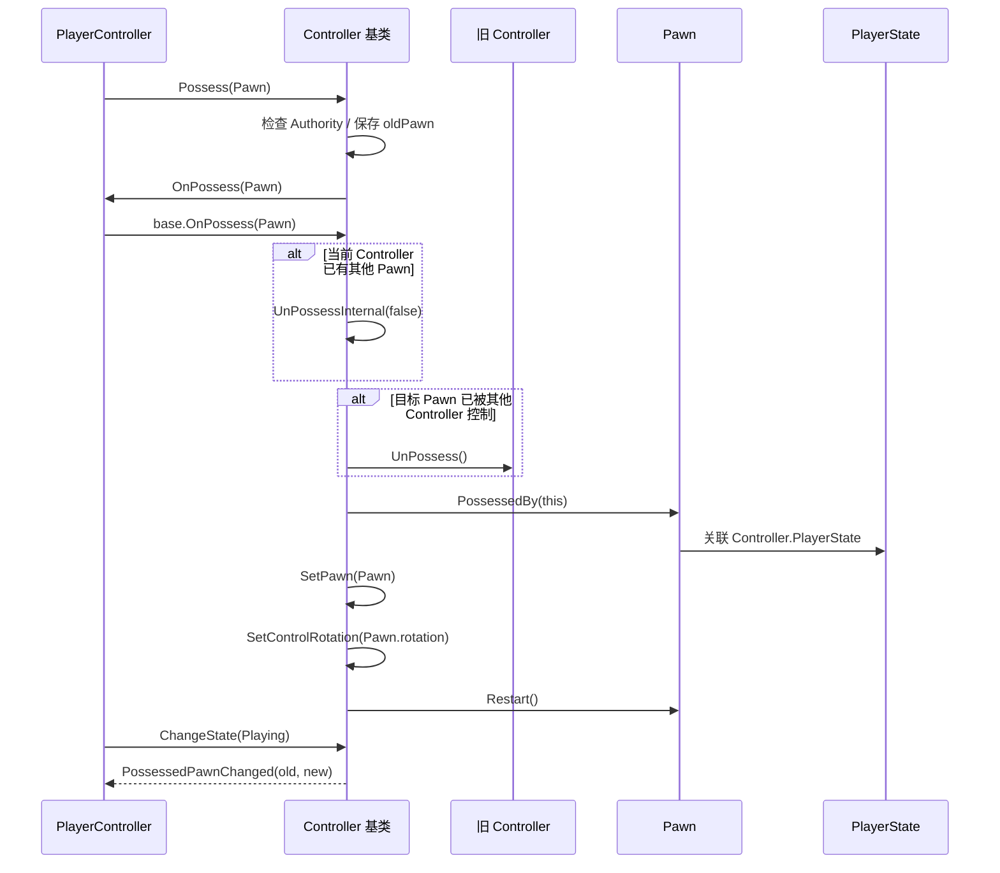
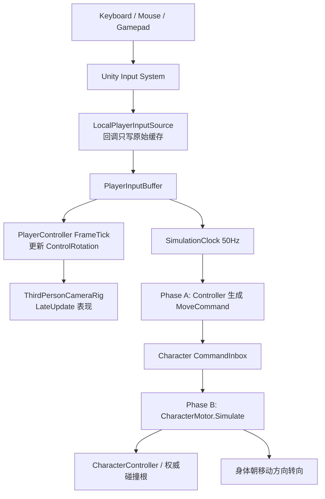
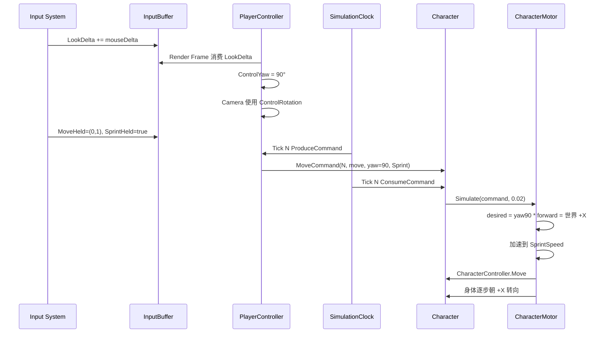

# RPG-DEMO 输入与控制实现审查及 AI 执行方案

> 项目路径：`E:\RPG-DEMO`  
> 审查日期：2026-07-23  
> 目标：先验证并加固现有 Possess/Possession，再完成“本地输入 → Controller → Tick 命令 → CharacterMotor”的离线闭环。  
> 本文是执行契约。执行 Agent 必须按阶段实现、测试和汇报，不得跳阶段一次性重写。

---

## 1. 结论先行

用户所说的 `process`，结合现有代码，应理解为 `Possess / Possession`。

当前实现不是完全错误，但它仍是“未运行的关系骨架”，不能视为已经完成的 Gameplay Demo：

- `Controller → Pawn → PlayerState` 的正常 Possess 主路径基本闭合。
- `SampleScene` 没有挂载任何 GameFramework 组件，项目中也没有任何 `Possess()` 调用。
- `Character` 为空类，没有移动、碰撞、重力、跳跃或转向。
- Input Actions 已定义，但没有任何脚本订阅，也没有 `PlayerInput` 组件。
- 没有 asmdef、EditMode 测试或 PlayMode 测试。
- 没有 NGO、Mirror、FishNet、Photon 等网络运行库。

输入和控制不能直接接在当前代码上。必须先修复以下阻塞问题：

| 等级 | 问题 | 后果 |
|---|---|---|
| P0 | `UnPossessInternal()` 不验证 Pawn 是否真的释放，却固定广播 `old → null` 并返回成功 | 派生类遗漏 `base.OnUnPossess()` 时，事件和真实状态冲突 |
| P0 | Possession 的核心双向关系修改放在可覆盖的 `OnPossess/OnUnPossess` 中 | 派生类可破坏“一 Pawn 一 Controller”不变量 |
| P0 | 同一个 PlayerState 可以被两个 Controller 同时引用 | `Controller.PlayerState` 与 `PlayerState.OwningController` 分裂 |
| P0 | 没有 Bootstrap、Prefab、测试场景和测试 | 现有流程从未被实际执行 |
| P1 | 手动 `PlayerController.UnPossess()` 后可能仍为 `Playing` | 输入门控会继续允许旧控制状态 |
| P1 | 没有重入保护，也不拒绝正在销毁的 Pawn | 回调中再次 Possess 会观察或提交中间态 |
| P1 | UnPossess 没有清空输入、命令、相机目标 | 换 Pawn 后可能出现旧移动、旧 Jump 或镜头泄漏 |
| P2 | `SetControlRotation` 没有把 `q` 与 `-q` 视为同一旋转 | 可能重复发旋转事件 |
| P2 | 极小四元数可能在归一化时除零 | 可能生成 Infinity/NaN |

执行顺序必须是：

```text
加测试
  → 加固 Possession/PlayerState 不变量
  → 实现纯数据输入缓存
  → 接入 Input System
  → 实现 ControlRotation
  → 建立固定 Simulation Tick
  → 实现 Character 命令消费和 Motor
  → 相机与测试场景闭环
```

---

## 2. 项目基线

### 2.1 已确认环境

| 项目项 | 当前值 | 证据 |
|---|---|---|
| Unity 版本 | `6000.2.7f2` | `ProjectSettings/ProjectVersion.txt:1` |
| 渲染管线 | URP `17.2.0` | `Packages/manifest.json:10` |
| Input System | `1.14.2` | `Packages/manifest.json:7` |
| Active Input Handling | New Input System，值为 `1` | `ProjectSettings/ProjectSettings.asset:922` |
| Fixed Timestep | `0.02s`，即 50Hz | `ProjectSettings/TimeManager.asset:6` |
| 网络运行库 | 无 | `Packages/manifest.json` |
| Cinemachine | 未安装 | `Packages/manifest.json` |
| Runtime asmdef | 无 | 项目文件扫描 |
| 自动化测试 | 无 | 项目文件扫描 |
| Gameplay Prefab | 无 | 项目文件扫描 |
| Gameplay 场景装配 | 无 | `Assets/Scenes/SampleScene.unity` |

`com.unity.multiplayer.center` 只是 Multiplayer Center，不等于已经安装并接入 NGO。

### 2.2 本机验证限制

项目要求 Unity `6000.2.7f2`。本机可见的 Editor 是 `D:\Unity\Editor\2022.3.62f3c1`，版本不匹配；没有发现对应 Unity 6.2 Editor。因此本次只能做静态源码审查，不能声称已经完成 Unity 编译或 PlayMode 验证。

执行 Agent 开始改代码前，必须先确认：

```powershell
$env:RPG_UNITY_EDITOR = '<Unity 6000.2.7f2 的 Unity.exe 绝对路径>'
Test-Path -LiteralPath $env:RPG_UNITY_EDITOR
```

禁止使用 Unity 2022 打开并自动升级/降级这个项目。

### 2.3 现有文档的关系

- `Controller复刻执行方案.md`：现有 Controller/Pawn 骨架的第一阶段规格。
- `复刻计划.md`：Controller、PlayerState、Character、网络预测的长期总计划。
- 本文：只负责审查当前落地结果，并规定下一步“输入和控制”的实际执行顺序。

发生冲突时：

1. 当前源码事实优先。
2. 本文对 Possession 修复、输入、控制、Tick 和离线 Motor 的要求优先。
3. 网络阶段仍遵循 `复刻计划.md`，但本轮不得提前实现。

---

## 3. 当前代码实际做了什么

### 3.1 类与文件

```text
Assets/GameFramework/Runtime/
├── Controller/
│   ├── Controller.cs
│   ├── PlayerController.cs
│   ├── AIController.cs
│   ├── ControllerStates.cs
│   └── PossessionResult.cs
├── Pawn/
│   ├── Pawn.cs
│   └── Character.cs
└── PlayerState/
    └── PlayerState.cs
```

当前职责：

| 类型 | 已实现 | 未实现 |
|---|---|---|
| Controller | Pawn/Character 缓存、Possess、UnPossess、ControlRotation、状态、输入忽略计数 | 实际输入、Tick、命令、相机、网络 Authority |
| PlayerController | 标记玩家 Controller；Possess 后进入 Playing | Input System、命令生成、UnPossess 状态恢复 |
| AIController | 空派生类型 | AI 意图和统一命令生成 |
| Pawn | Controller/PlayerState 反向引用、销毁通知、生命周期钩子 | MovementInput 缓存、命令邮箱、模拟 |
| Character | 仅继承 Pawn | Motor、碰撞、速度、重力、转向、跳跃 |
| PlayerState | OwningController 与 Pawn 引用 | 身份、比分、队伍、注册、网络复制 |

### 3.2 正常 Possess 调用链



源码入口：

- `Assets/GameFramework/Runtime/Controller/Controller.cs:46`
- `Assets/GameFramework/Runtime/Controller/Controller.cs:81`
- `Assets/GameFramework/Runtime/Controller/PlayerController.cs:12`
- `Assets/GameFramework/Runtime/Pawn/Pawn.cs:15`

正常完成后的不变量：

```text
Controller.Pawn        == Pawn
Controller.Character   == Pawn as Character
Pawn.Controller        == Controller

Controller.PlayerState == PlayerState
Pawn.PlayerState       == PlayerState
PlayerState.OwningController == Controller
PlayerState.Pawn       == Pawn
```

### 3.3 当前做对的部分

- `Possess()` 有 Authority 入口检查。
- 重复 Possess 当前 Pawn 返回 `AlreadyPossessed`，采用幂等语义。
- Controller 从 Pawn A 切换到 Pawn B 时，会先释放 A。
- 抢占其他 Controller 的 Pawn 时，会先请求旧 Controller 释放。
- Possess 成功后，Controller、Pawn 和 PlayerState 的正常基类路径能够闭合。
- Pawn 销毁时会通知 Controller 清理引用并进入 Inactive。
- ControlRotation 与 Pawn Transform rotation 已经是两份独立状态。
- Controller 销毁时会尝试 UnPossess 并清理 PlayerState。

### 3.4 必须修复的问题

#### 3.4.1 UnPossess 事件与返回值不可信

当前 `Controller.cs:109-125` 在执行可覆盖的 `OnUnPossess()` 后，无论 Pawn 是否真的改变，都广播 `oldPawn → null` 并返回 `true`。

必须改为：

```text
oldPawn = pawn
执行不可覆盖的解除事务
newPawn = pawn

if oldPawn != newPawn:
    广播 oldPawn → newPawn

return oldPawn != newPawn
```

UE 也会在 `OnUnPossess()` 后重新读取 Pawn，只在真实改变后广播：

`C:\Program Files\Epic Games\UE_5.7\Engine\Source\Runtime\Engine\Private\Controller.cpp:382`

#### 3.4.2 核心关系事务不能交给派生类

当前 `Controller.cs:81` 与 `:128` 允许派生类通过忘记调用 `base` 破坏关系。

最终结构应是：

```text
public 非虚 Possess/UnPossess
  ├── 固定修改 Controller.Pawn
  ├── 固定修改 Pawn.Controller
  ├── 固定更新 PlayerState.Pawn
  ├── 固定清空输入/命令
  └── 只调用通知钩子
      ├── OnBeforePossess
      ├── OnPossessed
      ├── OnBeforeUnPossess
      └── OnUnPossessed
```

通知钩子不得承担权威引用修改。

#### 3.4.3 必须检查旧 Controller 是否真的释放成功

执行：

```csharp
inPawn.Controller.UnPossess();
```

后必须重新检查：

```text
inPawn.Controller == null
```

如果旧 Controller 没有成功释放，新 Possess 必须失败，不能继续 `inPawn.PossessedBy(this)`。

`PossessionResult` 应增加能够区分原因的结果，例如：

```csharp
RejectedPawnStillPossessed
RejectedDestroyingPawn
RejectedReentrant
```

#### 3.4.4 PlayerState 必须唯一归属

以下操作目前会造成分裂：

```csharp
controllerA.SetPlayerState(sharedState);
controllerB.SetPlayerState(sharedState);
```

本阶段固定采用“拒绝隐式抢占 PlayerState”策略：

```text
若 newState.OwningController != null
且 newState.OwningController != this
则赋值失败，保持所有旧引用不变。
```

不要静默覆盖 `OwningController`，也不要在没有统一协调器时自动迁移。

#### 3.4.5 其他修复

- `PlayerController.OnUnPossess` 成功后切换到 `Inactive`。
- 增加 `isChangingPawn`，Possession 事务重入时明确拒绝。
- `Possess()` 拒绝 `Pawn.IsDestroying == true`。
- `SetControlRotation` 使用：

  ```csharp
  Mathf.Abs(Quaternion.Dot(oldRotation, newRotation))
  ```

- 归一化前校验 `sqrMagnitude > epsilon`，归一化后再次校验有限数。
- `Awake`、`OnDestroy` 等固定清理入口不要依赖派生类必须调用 base。
- 每次 Possess/UnPossess 提交后，在 Editor/Development Build 执行引用一致性断言。

### 3.5 当前有意保留的差异

- Unity 版重复 Possess 同一 Pawn 返回 `AlreadyPossessed`；UE 默认仍可能 Restart Pawn。
- Unity 版 `Possess(null)` 可以定义成 UnPossess；UE 仍把 null 交给 `OnPossess`。
- 当前 Authority 和 IsLocalController 是离线占位语义，不代表网络功能完成。

这些差异允许保留，但必须被测试固定，不能在后续 Agent 中悄悄改变。

---

## 4. 输入资产审查

### 4.1 已有 Action

`Assets/InputSystem_Actions.inputactions` 已包含：

| Action | 类型 | 当前绑定 |
|---|---|---|
| Move | Value / Vector2 | WASD、方向键、Gamepad Left Stick、Joystick、XR（Action 定义见 `:9`） |
| Look | Value / Vector2 | Pointer Delta、Gamepad Right Stick、Joystick（Action `:18`；绑定 `:226`、`:237`） |
| Jump | Button | Space、Gamepad South、XR（Action 定义见 `:54`） |
| Sprint | Button | Left Shift、Gamepad Left Stick Press、XR（Action `:81`；Left Shift `:347`） |
| Crouch | Button | C、Gamepad East |
| Attack | Button | 鼠标左键、Gamepad West 等 |
| Interact | Button + Hold | E、Gamepad North |

Input Actions 的 C# Wrapper 当前关闭：

`Assets/InputSystem_Actions.inputactions.meta:11`

```yaml
generateWrapperCode: 0
```

### 4.2 一个 Look Action 混合了两种单位

当前 `<Pointer>/delta` 和 `<Gamepad>/rightStick` 共用 `Look`：

- 鼠标 Delta 是位移增量，不应再乘 `deltaTime`。
- 手柄 Stick 是持续速率，必须乘 `deltaTime`。

如果统一处理，至少一种设备会随渲染帧率变化。

本阶段必须拆成：

| Action | 类型 | 绑定 | 处理方式 |
|---|---|---|---|
| LookDelta | PassThrough / Vector2 | `<Pointer>/delta` | 累加；不乘 dt |
| LookRate | Value / Vector2 | `<Gamepad>/rightStick` | 保存最新值；乘 frame dt |

Joystick/XR 不属于首个 MVP 的验收范围。可以保留绑定，但不要为它们阻塞 Keyboard/Mouse 与 Gamepad。

### 4.3 固定绑定方案

本项目不生成 C# Wrapper。本阶段固定使用：

```text
PlayerInput 组件
  + PlayerInput.actions
  + 代码中 FindActionMap/FindAction
  + 显式订阅 started/performed/canceled
```

理由：

- 项目已经有完整 InputActionAsset。
- 不依赖生成文件。
- PlayerInput 能承接未来本地多玩家和 Control Scheme。
- 当前项目没有任何 Action 引用，重命名 Look 不会破坏现有运行代码。

所有字符串 Action 名称集中定义在一个地方，不允许散落在 Character 或 Motor。

---

## 5. 目标架构



### 5.1 强制职责边界

| 层 | 可以做 | 禁止做 |
|---|---|---|
| LocalPlayerInputSource | 订阅 InputAction；写入原始输入缓存 | 访问 Pawn/Motor；移动 Transform |
| PlayerInputBuffer | 保存持续值、累加量、边沿锁存 | 读取 Time；访问场景对象 |
| PlayerController | 更新 ControlRotation；按 Tick 生成命令 | 直接调用 CharacterController.Move |
| Pawn/Character | 验证命令提交者；保存并消费命令 | 读取键盘、鼠标或 InputAction |
| CharacterMotor | 使用命令和传入 dt 做运动模拟 | 读取 Input System；自行启动另一套时钟 |
| CameraRig | 读取 ControlRotation 和 CameraAnchor 做表现 | 修改权威碰撞根或 Gameplay 速度 |

### 5.2 输入必须按语义缓存

| 输入类型 | 动作 | 缓存规则 | 消费后 |
|---|---|---|---|
| 持续值 | Move、SprintHeld、CrouchHeld | 保存最新状态，收到 canceled 才清除 | 保留 |
| 累加量 | Mouse LookDelta | 每个输入事件累加 | 清零 |
| 速率值 | Gamepad LookRate | 保存最新摇杆值 | 保留 |
| 边沿事件 | JumpPressed、AttackPressed | performed 时锁存 | 写入一个命令后清零 |

Jump 不能只保存“当前是否按住”。如果玩家在两个 Simulation Tick 之间快速按下并松开，Held 状态会在 Tick 到来前恢复 false，导致输入丢失。

### 5.3 Ignore 规则

`IsMoveInputIgnored` 和 `IsLookInputIgnored` 应在“应用输入”时判断，而不是阻断原始状态更新：

- Ignore Move：生成 neutral Move，但缓存仍跟踪当前按键。
- Ignore Look：不更新 ControlRotation，但仍接收设备状态。
- UnPossess、切换 Action Map、失去焦点：调用 `ResetAll()`，防止卡键。

这样解除 Ignore 后，如果玩家仍按住 W，下一 Tick 可以立即恢复移动。

---

## 6. 第一版数据契约

### 6.1 MoveCommandFlags

文件：

`Assets/GameFramework/Runtime/Input/MoveCommandFlags.cs`

```csharp
[Flags]
public enum MoveCommandFlags : byte
{
    None = 0,
    Sprint = 1 << 0,
    JumpPressed = 1 << 1,
    CrouchHeld = 1 << 2
}
```

### 6.2 MoveCommand

文件：

`Assets/GameFramework/Runtime/Input/MoveCommand.cs`

```csharp
public readonly struct MoveCommand
{
    public readonly uint Tick;
    public readonly Vector2 Move;
    public readonly float ControlYawDegrees;
    public readonly float ControlPitchDegrees;
    public readonly MoveCommandFlags Flags;
}
```

约束：

- `Move` 是角色局部输入：X=右，Y=前。
- `Move` 长度 Clamp 到 1。
- 命令保存绝对 ControlYaw，而不是只保存本帧 Look Delta。
- 首版使用 float；网络阶段再统一量化。
- 命令是不可变值类型，Tick 热路径不得产生 GC。

### 6.3 PlayerInputBuffer

文件：

`Assets/GameFramework/Runtime/Input/PlayerInputBuffer.cs`

最小状态：

```text
Vector2 MoveHeld
Vector2 LookDeltaAccumulated
Vector2 LookRateHeld
bool SprintHeld
bool CrouchHeld
bool JumpPressedLatched
```

最小 API：

```text
SetMove(Vector2)
AccumulateLookDelta(Vector2)
SetLookRate(Vector2)
SetSprint(bool)
SetCrouch(bool)
LatchJumpPressed()
ConsumeLookDelta()
ConsumeCommandTransientFlags()
ResetAll()
```

`PlayerInputBuffer` 必须是纯 C# 类型，不继承 MonoBehaviour，以便 EditMode 测试。

### 6.4 Character 命令邮箱

Character 只接受当前 Controller 提交的命令：

```text
SubmitMoveCommand(sender, command)
  ├── sender 必须等于 Character.Controller
  ├── Tick 必须大于最后已消费 Tick
  ├── 同 Tick 重复命令必须拒绝或明确覆盖
  └── UnPossess/换 Controller 时清空
```

无命令 Tick 使用 Neutral Command，不能重复触发上一 Tick 的 Jump。

---

## 7. Tick 与帧的关系

### 7.1 两个时钟

本项目应明确区分：

```text
Render Frame
  ├── Input System 回调
  ├── PlayerController 更新 ControlRotation
  └── Camera LateUpdate

Simulation Tick（固定 50Hz）
  ├── Phase A：所有 Controller 生产命令
  └── Phase B：所有 Character/Motor 消费命令
```

ControlRotation 每渲染帧更新，可以保持镜头低延迟；移动命令在固定 Tick 捕获绝对 Yaw，保证模拟顺序稳定。

### 7.2 SimulationClock

新增：

`Assets/GameFramework/Runtime/Simulation/SimulationClock.cs`

首版采用 `Update` 累加器，不允许 Controller 和 Character 各自拥有 FixedUpdate：

```text
accumulator += frameDelta

while accumulator >= tickInterval:
    Tick++
    Phase A: ProduceCommands(Tick, tickInterval)
    Phase B: SimulateCharacters(Tick, tickInterval)
    accumulator -= tickInterval
```

默认：

```text
TickRate = 50
TickInterval = 0.02
MaxCatchUpTicksPerFrame = 4
```

要求：

- Tick 内传入固定 dt，Motor 不读取 `Time.deltaTime`。
- Producer 必须在 Consumer 前完成。
- 注册顺序稳定；Tick 中不使用 LINQ。
- 一帧追赶多个 Tick 时，Jump 只进入第一个命令。
- 超过最大追赶次数时记录统计/警告，并采用明确的丢时策略。
- 暂停由 SimulationClock 显式控制。
- `CharacterMotor` 不再实现自己的 Update/FixedUpdate。

### 7.3 为什么不在输入回调里移动

Input 回调和模拟 Tick 不是同一个时钟：

- 同一渲染帧可能收到多次鼠标事件。
- 一个低帧率 Render Frame 可能需要追赶多个 Simulation Tick。
- 也可能一个 Render Frame 内没有 Simulation Tick。

若回调直接移动：

- 速度会依赖事件次数和渲染 FPS。
- Jump 等短按可能丢失或重复。
- Controller 与 Character 顺序不可控。
- 未来无法保存、发送和重演命令。
- 无法做服务器纠错后的未确认输入回放。

缓存的目的不是“故意增加延迟”，而是把不规则设备事件转换成每个模拟步都能解释的一份确定命令。

---

## 8. “向右转，然后跑步”的完整过程

假设：

- Unity 初始 ControlYaw = 0°。
- Unity 世界前方是 +Z。
- 玩家先将镜头向右转到 90°。
- 随后按住 W；如果同时按 Shift，则为 Sprint。



世界方向计算：

```csharp
Quaternion yawRotation =
    Quaternion.Euler(0f, command.ControlYawDegrees, 0f);

Vector3 localMove =
    new Vector3(command.Move.x, 0f, command.Move.y);

Vector3 worldMove =
    yawRotation * localMove;
```

当 Yaw=90° 且 W=`(0,1)` 时，`Vector3.forward` 被旋转到世界 +X，所以角色向世界右侧移动。

身体转向采用：

```csharp
Quaternion.RotateTowards(
    currentRotation,
    desiredMoveRotation,
    turnSpeedDegrees * dt);
```

首版行为是：

- 镜头先跟 ControlRotation 转动。
- Character 没有移动输入时不强制跟随镜头 Yaw。
- 开始移动后，身体一边加速一边朝移动方向转身。

这不是“先原地转完，再允许迈步”。严格的 TurnInPlace/MovementGate 是后续动画状态功能，不应混入第一版基础移动。

---

## 9. 文件变更清单

### 9.1 修改现有文件

| 文件 | 修改目的 |
|---|---|
| `Assets/GameFramework/Runtime/Controller/Controller.cs` | 加固 Possession 事务、重入保护、真实事件结果、四元数校验、命令阶段入口 |
| `Assets/GameFramework/Runtime/Controller/PlayerController.cs` | InputSource 生命周期、Frame Look、ControlRotation、MoveCommand 生产 |
| `Assets/GameFramework/Runtime/Controller/AIController.cs` | 预留同格式命令生产，不直接移动 Pawn |
| `Assets/GameFramework/Runtime/Controller/PossessionResult.cs` | 增加明确拒绝原因 |
| `Assets/GameFramework/Runtime/Pawn/Pawn.cs` | Possession 固定内部方法、命令/移动输入清理、开发断言 |
| `Assets/GameFramework/Runtime/Pawn/Character.cs` | 命令邮箱、Motor 引用、消费入口 |
| `Assets/GameFramework/Runtime/PlayerState/PlayerState.cs` | 唯一 OwningController/Pawn 约束 |
| `Assets/InputSystem_Actions.inputactions` | Look 拆成 LookDelta/LookRate |

### 9.2 新增 Runtime 文件

```text
Assets/GameFramework/Runtime/
├── RPGDemo.GameFramework.asmdef
├── Input/
│   ├── MoveCommand.cs
│   ├── MoveCommandFlags.cs
│   ├── PlayerInputBuffer.cs
│   └── LocalPlayerInputSource.cs
├── Simulation/
│   ├── SimulationClock.cs
│   ├── ISimulationCommandProducer.cs
│   └── ISimulationCommandConsumer.cs
├── Movement/
│   ├── CharacterMotor.cs
│   └── CharacterMovementSettings.cs
├── Camera/
│   └── ThirdPersonCameraRig.cs
└── Bootstrap/
    └── GameplayBootstrap.cs
```

Runtime asmdef 至少引用：

```text
Unity.InputSystem
```

### 9.3 新增测试文件

```text
Assets/GameFramework/Tests/
├── EditMode/
│   ├── RPGDemo.GameFramework.EditModeTests.asmdef
│   ├── ControllerPossessionTests.cs
│   ├── PlayerStateOwnershipTests.cs
│   ├── PlayerInputBufferTests.cs
│   └── SimulationClockTests.cs
└── PlayMode/
    ├── RPGDemo.GameFramework.PlayModeTests.asmdef
    ├── CharacterMotorTests.cs
    └── PlayerControlFlowTests.cs
```

测试 asmdef 必须标记为 Test Assembly，并引用 Runtime asmdef。Input System 设备测试使用 Input System 测试支持，不得依赖真实键盘鼠标。

### 9.4 场景与装配

不要直接破坏现有 `SampleScene`。新增：

```text
Assets/Scenes/GameplayInputTest.unity
```

推荐层级：

```text
Systems
├── SimulationClock
└── GameplayBootstrap

LocalPlayer
├── PlayerController
├── LocalPlayerInputSource
├── PlayerInput
└── PlayerState

PlayerCharacter
├── RPGDemo.GameFramework.Character
├── UnityEngine.CharacterController
├── CharacterMotor
├── VisualRoot
│   └── Capsule/Cube 测试模型
└── CameraAnchor

Environment
└── Ground

Main Camera
└── ThirdPersonCameraRig
```

Bootstrap 顺序：

```text
注册 Simulation Producer/Consumer
PlayerController.SetPlayerState(PlayerState)
PlayerController.Possess(PlayerCharacter)
相机绑定 PlayerController 与 CameraAnchor
```

---

## 10. CharacterMotor 离线 MVP

第一版明确选择 `UnityEngine.CharacterController`，不使用 Rigidbody，不做自定义 CapsuleCast Motor。

### 10.1 必须实现

- 水平加速度。
- 无输入时制动。
- WalkSpeed / SprintSpeed。
- 重力。
- Grounded 状态。
- 轻微向下的贴地速度。
- Jump 边沿请求。
- `CharacterController.Move(velocity * dt)`。
- 身体朝非零移动方向转向。
- 速度、Grounded、最后模拟 Tick 可只读观察。

### 10.2 建议参数

参数必须序列化并可测试，不应写死在算法内部：

```text
WalkSpeed
SprintSpeed
GroundAcceleration
GroundBraking
AirAcceleration
Gravity
JumpHeight
GroundStickVelocity
TurnSpeedDegrees
```

### 10.3 必须禁止

- Input 回调调用 `CharacterController.Move`。
- Motor 读取 `Keyboard.current`、`Mouse.current` 或 InputAction。
- Motor 读取 `Time.deltaTime`。
- Character 和 Motor 各自再开 FixedUpdate。
- 直接 `transform.Translate` 穿过碰撞。
- 无移动输入时用 ControlYaw 强制旋转身体。
- Animator/VisualRoot 成为权威碰撞位置。

### 10.4 确定性声明

Unity CharacterController 和 Physics 不是跨机器 bitwise deterministic。

本阶段目标是：

- 固定命令顺序。
- 固定传入 dt。
- 相同环境下足够接近的重复结果。
- 为未来服务器纠错保留 `CaptureState/Restore/Simulate` 边界。

禁止在没有实际网络测试的情况下声称已经实现 UE SavedMove 或严格确定性。

---

## 11. 分阶段执行计划

每个阶段必须：

1. 开始前列出要修改和新增的文件。
2. 只做本阶段范围。
3. 运行对应测试。
4. 报告实际结果、失败日志和剩余风险。
5. 测试不绿不得进入下一阶段。

### 阶段 0：建立可编译基线

任务：

- 记录 `git status --short --branch`。
- 确认 Unity `6000.2.7f2` Editor。
- 用正确 Editor 打开一次项目，记录修改前 Console。
- 新增 Runtime/EditMode/PlayMode asmdef。
- 不改变 Gameplay 行为。
- 为现有 Possess 主路径补基线测试。

基线测试：

- 首次 Possess。
- 重复 Possess。
- Pawn A 切到 Pawn B。
- 抢占另一个 Controller 的 Pawn。
- UnPossess。
- Pawn Destroy。
- Controller Destroy。
- PlayerState 跨 Pawn 保留。
- 事件触发次数。
- 非法 Quaternion。

完成条件：

- 项目编译。
- 测试可从命令行重复运行。
- 已记录现有失败；不得把现有失败伪装成新实现成功。

### 阶段 1：加固 Possession 事务

任务：

- 把双向关系修改收回不可覆盖核心事务。
- 派生类只保留前后通知钩子。
- UnPossess 根据真实 `newPawn` 返回和广播。
- 旧 Controller 未释放时拒绝新 Possess。
- 添加重入保护。
- 拒绝 IsDestroying Pawn。
- 修复 PlayerController UnPossess 后状态。
- Possess/UnPossess 后执行一致性断言。
- 清理入口为后续输入提供统一 Hook。

验收：

- 任意失败路径都保持事务前的稳定关系。
- 不会出现两个 Controller 同时持有一个 Pawn。
- 事件中只能观察到最终稳定状态。
- 失败事件不得谎报 `old → null`。

### 阶段 2：加固 PlayerState 与 ControlRotation

任务：

- 拒绝一个 PlayerState 同时属于两个 Controller。
- 统一 PlayerState Owner/Pawn 绑定入口。
- `Controller.SetPawn()` 不再单方面伪造 PlayerState.Pawn。
- 修复四元数等价判断和归一化边界。
- 明确 Authority/IsLocalController 为离线占位。

验收：

- 两个 Controller 绑定同一 PlayerState 必须失败且不改变旧关系。
- 换 Pawn 后 PlayerState 仍属于原 Controller，但 Pawn 指向新 Pawn。
- Pawn 销毁后 PlayerState 保留，PlayerState.Pawn 为空。
- `q` 与 `-q` 不重复触发事件。

### 阶段 3：实现纯数据 InputBuffer

任务：

- 新增 MoveCommand、Flags、PlayerInputBuffer。
- 不接场景、不接 Input System。
- 所有缓存 API 无 GC。

验收：

- W 持续按住，连续多个 Tick 都产生 Move `(0,1)`。
- 多次 Mouse Delta 在消费前正确求和，消费后归零。
- Gamepad LookRate 在消费后仍保持。
- Jump 在两个 Tick 之间按下并松开，下一 Tick 仍出现一次。
- Jump 不会进入第二个 Tick。
- ResetAll 清除 Move、Look、Sprint、Jump。

### 阶段 4：接入 Unity Input System

任务：

- 拆分 LookDelta/LookRate。
- 新增 LocalPlayerInputSource。
- 使用 PlayerInput.actions 查找并订阅 Action。
- OnEnable 成对订阅/Enable。
- OnDisable 先退订，再 Disable，并 ResetAll。
- UnPossess、失焦、切输入上下文时 ResetAll。
- 回调只写 Buffer。

验收：

- 虚拟 Keyboard/Mouse/Gamepad 能正确驱动 Buffer。
- performed/canceled 成对处理。
- 快速 Jump 不丢。
- 没有回调直接访问 Character/Motor/Transform。

### 阶段 5：实现 ControlRotation 与相机方向

任务：

- PlayerController 每 Render Frame 消费 Mouse LookDelta。
- Mouse Delta 不乘 dt。
- Gamepad LookRate 乘 frame dt。
- Pitch Clamp，例如 `[-80°, 80°]`。
- Roll 固定为 0。
- Yaw 规范化到统一范围。
- 使用 `SetControlRotation`。
- IgnoreLook 时不改变旋转。

验收：

- 相同鼠标总 Delta 在 30/60/144 FPS 下产生相同 Yaw。
- 手柄保持一秒，在不同 FPS 下产生相同 Yaw。
- Pitch 不越界。
- 相机方向与 Character 身体旋转彼此独立。

### 阶段 6：实现 SimulationClock 与命令两阶段

任务：

- 新增 50Hz SimulationClock。
- Phase A 生成全部命令。
- Phase B 消费全部命令。
- Tick 带稳定递增 uint。
- 限制每 Render Frame 最大追赶 4 Tick。
- 不允许其他 Gameplay FixedUpdate 形成第二套时钟。

验收：

- 相同输入和初始状态，不同 Render Frame 序列产生相同命令 Tick 序列。
- Producer 始终早于 Consumer。
- 一帧追赶多个 Tick 时 Jump 只进入第一个。
- 超出追赶上限有可观察统计。

### 阶段 7：实现 Character 命令邮箱与 Motor

任务：

- Character 只接受当前 Controller 的命令。
- 换 Controller/UnPossess 清空命令。
- 新增 CharacterController Motor。
- 实现走、跑、制动、重力、贴地、Jump、移动朝向。
- 所有模拟只使用命令和传入 dt。

验收：

- 未 Possess 的 Character 不响应本地输入。
- W 相对 ControlYaw 前进。
- Shift 切换 SprintSpeed。
- 松开 W 后按制动参数停止。
- Jump 只触发一次。
- 角色不会穿过测试墙和地面。
- 稳态 Tick 无托管分配。

### 阶段 8：测试场景与完整闭环

任务：

- 新建 `GameplayInputTest.unity`。
- 添加地面、Controller、PlayerState、Character、Motor、PlayerInput、Clock、相机、Bootstrap。
- 不覆盖 SampleScene。
- Bootstrap 执行 SetPlayerState 和 Possess。

验收场景：

1. Play 后 Controller 为 Playing。
2. 初始 Yaw=0 时，W 沿 +Z。
3. 右转到 Yaw=90 后，W 沿 +X。
4. 身体逐步转向移动方向，相机不被身体插值拖回。
5. Shift 提升最大速度。
6. UnPossess 后立即停止接受新命令。
7. Pawn A 切到 Pawn B 后，旧 Pawn 不再移动，新 Pawn 不继承旧 Jump/Look。
8. Destroy Pawn 后 Controller/PlayerState 引用正确清理。

### 阶段 9：只预留网络重演接口

可以新增：

```text
MoveCommand.Tick
固定容量 CommandHistory
CharacterMotorState
CharacterMotor.CaptureState()
CharacterMotor.Restore(state)
CharacterMotor.Simulate(command, dt)
```

不得新增：

```text
RPC
Server Ack
Client Prediction
Correction/Replay
Observer Snapshot
NGO/Mirror/FishNet 依赖
```

网络库和拓扑由用户明确选择后再执行。

---

## 12. 自动化测试矩阵

| 分类 | 测试 | 通过条件 |
|---|---|---|
| Possession | 首次 Possess | Controller/Pawn/PlayerState 引用闭合 |
| Possession | 重复 Possess | 幂等；无重复事件 |
| Possession | A → B | A 完整解绑；只广播一次 A→B |
| Possession | 抢占 Pawn | 旧 Controller 为空后新 Controller 才提交 |
| Possession | 旧 Controller 拒绝释放 | 新 Possess 失败；不产生双 Controller |
| Possession | 重入 | 拒绝或延迟；不提交中间态 |
| PlayerState | 两 Controller 共用 | 明确拒绝；旧关系不变 |
| Destroy | Pawn 销毁 | Controller Pawn/Character 为空；PlayerState 保留 |
| Destroy | Controller 销毁 | Pawn.Controller/PlayerState 为空 |
| Rotation | q 与 -q | 不重复发事件 |
| Input | Move Held | 每 Tick 持续有 Move |
| Input | Mouse Delta | 累加一次消费，不乘 dt |
| Input | Gamepad Rate | 持续保存，乘 dt |
| Input | Jump Edge | 快速点击不丢，只消费一次 |
| Input | ResetAll | 换 Pawn 后无旧输入残留 |
| Ignore | 嵌套计数 | 两次 Ignore 需要两次 Release |
| Tick | 顺序 | Controller Producer 早于 Character Consumer |
| Tick | 追赶 | 多 Tick 时边沿只进入第一 Tick |
| Direction | Yaw 90 + W | Unity 世界 +X |
| Sprint | MaxSpeed | Sprint Flag 决定统一速度 |
| Frame Rate | 30/60/144 FPS | 固定 Tick 结果在容差内一致 |
| Collision | 墙/地面 | CharacterController 不穿透 |
| Performance | 稳态 Tick | 0B GC Alloc |

---

## 13. UE 源码对照

执行 Agent 在关键设计前必须阅读对应入口，不要凭印象翻译：

| 主题 | UE 5.7 源码 |
|---|---|
| Possess | `Runtime/Engine/Private/Controller.cpp:316` |
| OnPossess | `Runtime/Engine/Private/Controller.cpp:352` |
| UnPossess | `Runtime/Engine/Private/Controller.cpp:382` |
| Controller 先于 Pawn/Movement Tick | `Runtime/Engine/Private/Controller.cpp:491` |
| SetPawn Tick 依赖 | `Runtime/Engine/Private/Controller.cpp:526` |
| Player 输入与旋转顺序 | `Runtime/Engine/Private/PlayerController.cpp:2309` |
| 输入栈处理 | `Runtime/Engine/Private/PlayerController.cpp:2768` |
| RotationInput → ControlRotation | `Runtime/Engine/Private/PlayerController.cpp:1037` |
| AddYawInput 累加 | `Runtime/Engine/Private/PlayerController.cpp:5964` |
| AddMovementInput | `Runtime/Engine/Private/Pawn.cpp:799` |
| MovementInput 累加 | `Runtime/Engine/Private/Pawn.cpp:838` |
| MovementInput 消费清零 | `Runtime/Engine/Private/Pawn.cpp:846` |
| CharacterMovement 消费输入 | `Runtime/Engine/Private/Components/CharacterMovementComponent.cpp:1622` |
| 输入转 Acceleration | `Runtime/Engine/Private/Components/CharacterMovementComponent.cpp:6340` |
| 朝移动方向转身 | `Runtime/Engine/Private/Components/CharacterMovementComponent.cpp:6530` |

UE 关键顺序：

```text
Input Event
  → PlayerController 累加 RotationInput / Pawn 累加 MovementInput
  → Controller Tick 更新 ControlRotation
  → Movement Tick ConsumeInputVector
  → 输入转换为 Acceleration
  → PerformMovement
  → PhysicsRotation
```

Unity 版不需要复制 UE 的宏、Actor Tick 系统或网络 Role，但必须保留：

- 输入事件与模拟消费分离。
- Controller ControlRotation 与 Character 身体旋转分离。
- Controller 阶段先于 Character Movement 阶段。
- 持续值、累加量、边沿事件采用不同缓存语义。
- 相同命令可用于未来本地预测、服务器重演和纠错回放。

---

## 14. Agent 执行规则

### 14.1 每阶段汇报模板

```text
阶段：
目标：
修改文件：
新增文件：
关键设计：
执行的测试命令：
测试结果：
失败日志路径：
git diff --check：
剩余风险：
是否满足进入下一阶段的条件：
```

### 14.2 禁止事项

- 不修改 UE 源码。
- 不使用 Unity 2022 打开 Unity 6.2 项目。
- 不执行 `git reset --hard`、`git checkout --` 或覆盖用户变更。
- 不把 Input 回调直接连接到 Transform/CharacterController.Move。
- 不让 Character、Motor、Animator 读取 Input System。
- 不让多个组件各自维护独立固定时钟。
- 不在 Motor 中读取 `Time.deltaTime`。
- 不在本阶段添加网络库。
- 不声称 `hasAuthority=true` 已经实现网络 Authority。
- 不把 VisualRoot/Animator Root 当成权威碰撞位置。
- 不手工修改不理解的 Scene YAML；优先使用 Unity Editor 或可重复的 Editor 工具生成。
- 不为“结构漂亮”一次性重命名全部现有类型或目录。

### 14.3 需要暂停并请求用户决策的情况

- Unity `6000.2.7f2` 无法安装或定位。
- 发现用户已有未提交改动与当前文件冲突。
- 用户要求立即联网，但未选择 NGO/Mirror/FishNet 或拓扑。
- 用户要求严格跨机器确定性；这将改变 CharacterController 方案。
- 需要根运动、TurnInPlace 或动画驱动位移进入第一个 MVP。
- 需要本地分屏多玩家；PlayerInput 与 Bootstrap 装配会改变。

---

## 15. 命令行验证模板

执行前创建 `E:\RPG-DEMO\TestResults`，不得把测试结果提交进 Runtime 源码目录。

EditMode：

```powershell
& $env:RPG_UNITY_EDITOR `
  -batchmode `
  -nographics `
  -projectPath 'E:\RPG-DEMO' `
  -runTests `
  -testPlatform EditMode `
  -testResults 'E:\RPG-DEMO\TestResults\editmode.xml' `
  -logFile 'E:\RPG-DEMO\TestResults\editmode.log' `
  -quit
```

PlayMode：

```powershell
& $env:RPG_UNITY_EDITOR `
  -batchmode `
  -nographics `
  -projectPath 'E:\RPG-DEMO' `
  -runTests `
  -testPlatform PlayMode `
  -testResults 'E:\RPG-DEMO\TestResults\playmode.xml' `
  -logFile 'E:\RPG-DEMO\TestResults\playmode.log' `
  -quit
```

每阶段结束还必须运行：

```powershell
git -C 'E:\RPG-DEMO' status --short
git -C 'E:\RPG-DEMO' diff --check
git -C 'E:\RPG-DEMO' diff --stat
```

---

## 16. 完成定义

只有同时满足以下条件，输入与控制第一阶段才算完成：

- Possession 事务在成功、失败、抢占、销毁和重入路径下都保持不变量。
- PlayerState 不会被多个 Controller 静默共享。
- Input 回调只更新缓存。
- Mouse Delta、Gamepad LookRate、Move Held、Jump Edge 语义正确。
- ControlRotation 与 Character 身体旋转独立。
- SimulationClock 固定 50Hz，Controller 生产命令早于 Character 消费。
- CharacterMotor 只通过 `Simulate(command, dt)` 移动 CharacterController。
- Yaw=90° 后按 W，角色沿 Unity 世界 +X 移动。
- Sprint、Jump、制动、重力和碰撞通过 PlayMode 测试。
- UnPossess/换 Pawn 后不存在旧输入、旧命令或相机目标泄漏。
- EditMode 与 PlayMode 测试全部通过。
- 稳态模拟 Tick 无 GC Alloc。
- 没有添加未经用户确认的网络功能。

完成以上闭环后，下一阶段才是 UE SavedMove 对应的命令历史、客户端预测、服务器重演、Ack、纠错和未确认命令回放。

---

## 17. 可直接交给执行 Agent 的首条指令

```text
项目路径是 E:\RPG-DEMO。

完整阅读：
1. E:\RPG-DEMO\输入与控制实现审查及AI执行方案.md
2. E:\RPG-DEMO\Controller复刻执行方案.md
3. E:\RPG-DEMO\复刻计划.md

这次只执行《输入与控制实现审查及AI执行方案》的“阶段 0：建立可编译基线”，不要进入阶段 1。

开始时先做只读审计并汇报：
- git status
- Unity 项目版本
- 实际 Unity.exe 路径和版本
- 当前 Console 编译状态
- 当前场景、asmdef、测试和 Input System 状态
- 计划新增/修改的精确文件列表

然后：
- 建立 Runtime、EditMode Tests、PlayMode Tests asmdef；
- 为现有 Possess/UnPossess/PlayerState/ControlRotation 写基线测试；
- 不修改现有 Gameplay 语义来迎合测试；
- 运行 EditMode 和 PlayMode 测试；
- 运行 git diff --check；
- 用文档 14.1 的模板汇报。

如果找不到 Unity 6000.2.7f2，或工作区出现与任务文件冲突的用户改动，停止写入并报告，不得用 Unity 2022 打开项目，不得擅自升级或降级。
```
